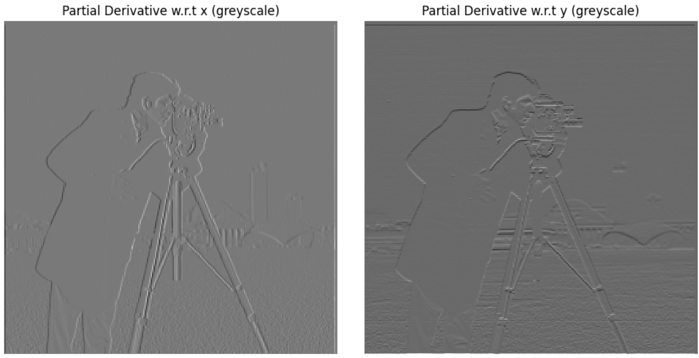
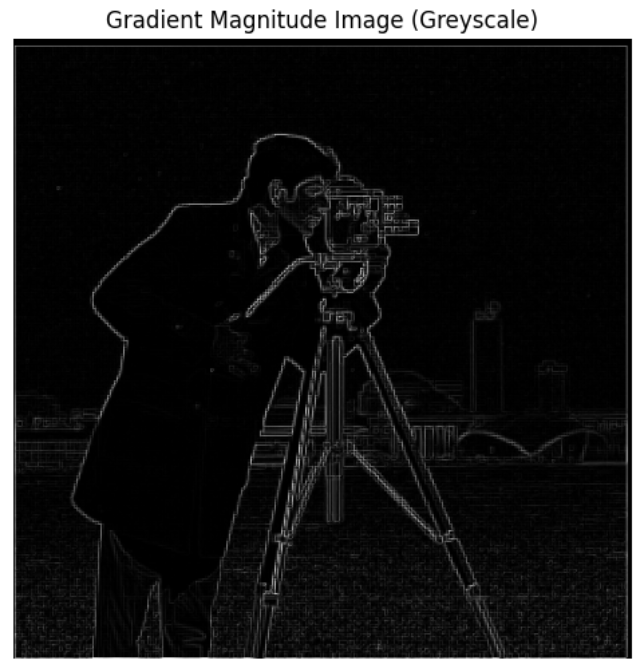
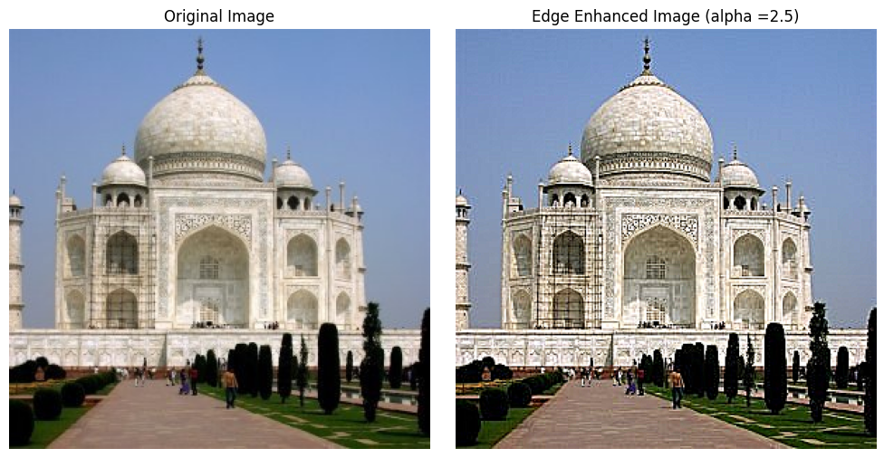
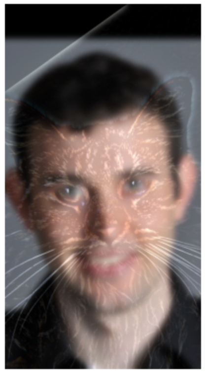
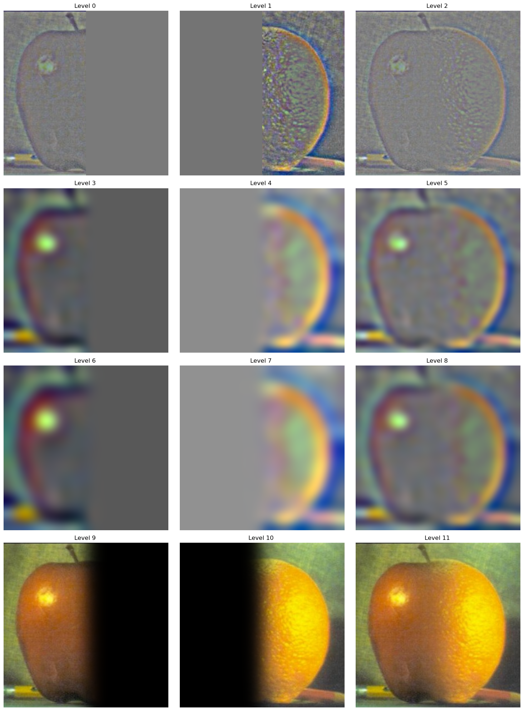
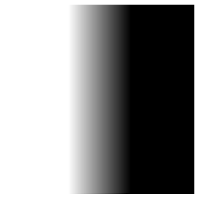
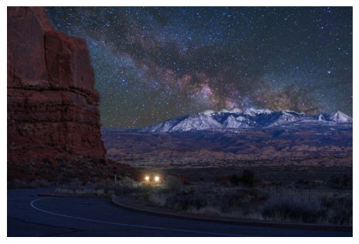
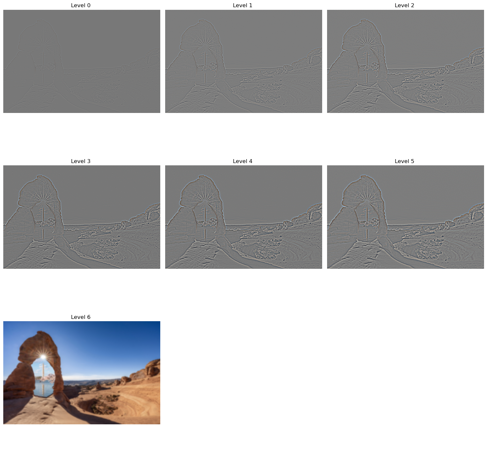

# CS 180 Project 2 Image Hybritaion and Blending

## Introduction

In digital image processing, understanding image frequencies can unlock new possibilities for creative and technical applications. Images are made up of different frequency components, where low frequencies capture the general structure, and high frequencies represent fine details. By manipulating these frequency domains, we can blend images seamlessly, creating visually striking results. In this blog, we’ll dive into the fascinating world of image frequencies, explore various image blending techniques, and demonstrate how these concepts can be used to achieve everything from smooth transitions to high-impact visual effects.

## Section 1: Filters

### Finite Difference Operator

Finite difference operators play a crucial role in image processing by helping us detect changes and gradients within an image. These operators approximate derivatives by comparing pixel values in a local neighborhood, enabling us to capture edges and other important features.

The operators are mathmatically defined as the following:

$$
D_x = \begin{bmatrix}
1&-1
\end{bmatrix} \quad D_y = \begin{bmatrix}
1\\-1
\end{bmatrix}
$$

Easy to observe that when convolving with the images, $D_x$ measures the change in intensity between two horizontal pixels, while $D_y$ measures that difference in the vertical direction.

In code, we use `numpy` to define the operators as `D_x = np.array([1,-1])` and `D_y = D_x.T`, and we use `scipy.signal.convolve2d` to apply them on the images.

For this example image,

Converting the original image to grayscale and applying the filters respectively will result in

By observation, we can see that indeed, the $D_x$ operator detects horizontal changes and thus the result looks vertical, and $D_y$ detects vertical changes and looks horizontal.

The gradient magnitude can be derive by the equation below:

$$
G(x,y) = \sqrt{(D_x(x,y))^2 + (D_y(x,y))^2}
$$

The result is

One may notice that there are many white noise densed around the lower half of the image, and to suppress the noise, we can choose a `threshold` (here I choose `threshold=0.2` and `threshold=0.35`) to make all pixels below the threshold go to zero, and all points above get promoted to 1. Here are the results of a low threshold (0.2) and a high threshold (0.35):

---

### Gaussian Low-Pass Filter

However, we notice that by setting threshold and binarizing the picture, we will filter out some real edges along with the white noise. To address this, we can use a Gaussian low-pass filter to preprocess the picture and smooth out some of the high-frequency noises.

We will create a gaussian low-pass filter by specifying the standard deviation $\sigma$, and since we wish to capture all of the gaussian features (ranging from $-3\sigma$ to $3\sigma$), we can compute the length of the 1-$d$ gaussian vector as

$$
n = 2\times\lceil 3\sigma \rceil + 1
$$

and we can compute the 2-$d$ gaussian kernel as `n = int(2*np.ceil(3*sigma) + 1)`, `gauss = cv2.getGaussianKernel(n,sigma)`, and `gauss2d = gauss @ gauss.T`

We can apply gaussian filter $G$ and $D_x$ (or $D_y$) sequentially to get the smoothed partial derivatives, and then compute the gradient magnitude image using the formula mentioned above. Then, we binarize the image using `threshold = 0.09`. The results are the follows:

Indeed, the final result has much less white noise and the real edges are all well-preserved.

Additionally, due to the distributivity of convolution, we have

$$
(I(x,y) * G) * D_x = I(x,y) * (G * D_x)
$$

and we can precompute the partial derivatives of gaussian filter and use them to get smoothed image partial derivative. The results are

We can verify that the results are compatible by computing the $l$-2 norm of the difference between the two results. This table shows that the difference is small:

| Difference         | Value                 |
| ------------------ | --------------------- |
| x-derivative       | 2.564316634668458     |
| y-derivative       | 0.0011243681585536669 |
| gradient magnitude | 2.503822212657084     |
| binarized gradient | 21.3775577545166      |

(Here, the last entry has larger difference because each imcompatible pixel between binarized images brings the difference up by 1)

---

## Section 2: Frequencies

### Image Shapening

By applying the gaussian filter to an image, we can get the low freqencies of the image. And by subtracting the low frequencies from the original image, we can get the edges and details of the image. Therefore, we can edge enhance the image by adding extra high frequencies via the formula below:

$$
G_{\text{enhance}} = (1+\alpha)*e - \alpha*G
$$

where $\alpha$ is the degree of enhancement. And

$$
I_{\text{enhance}} = I*G_{\text{enhance}} \iff I + \alpha\times I_{\text{edges}}
$$

Here are some results of edge enhancement:

To verify the effectiveness of sharpening, we can blur an image first and then try to recover it with sharpening:

Unfortunately, the recovered image is still  blurer than the original one, because the original high frequencies are already lost during low-pass filtering.

Here is another example of edge sharpening on a photo I shot at the delicate arch:

### Hybrid Images

#### Introduction

The high frequencies represents details, while low frequencies allow one to recognize the general shape of the objects in an image. These features of different frequencies allow us to create hybrid images.

Hybrid images are static visuals that shift in how they are perceived based on the viewer's distance. The key concept is that high-frequency details dominate when viewed closely, while at greater distances, only the low-frequency, smoother elements are visible. By combining the high-frequency details of one image with the low-frequency components of another, the resulting hybrid image offers varying interpretations depending on the distance from which it is viewed.

#### Methology and Implementation

To create a hybrid image, we simply extract low frequencies of $I_A$ and high frequencies of $I_B$ and add them together. Again, we utilize the 2-$d$ gaussian kernel to filter out certain frequencies and achieve our goal.

Mathematically, given cutoff frequency $f_c$, we have the following derivation.

**Low-pass Filter:**

Given origin-centered 2-$d$ gaussian $g(x,y) = \frac{1}{2\pi\sigma^2}\exp\{-\frac{x^2+y^2}{2\sigma^2}\}$, its fourier transform is $G(u,v) = \exp\{-2\pi^2f^2\sigma^2\} = G(f)$, where $f^2 = u^2+v^2$ is the frequency in fourier domain. By the [definition of cutoff frequency](https://en.wikipedia.org/wiki/Half-power_point), we want to find the value of $\sigma$ such that for all frequencies after $f_c$, convolution with this gaussian will have the output power has dropped to half of its peak value. That is

$$
\begin{equation*}
\begin{aligned}
&\exp\{-2\pi^2f^2\sigma^2\} = \frac{1}{\sqrt{2}}\\
\implies&\sigma = \frac{\sqrt{\ln 2}}{2\pi f_c}
\end{aligned}
\end{equation*}
$$

**High-pass Filter:**

For high-pass, we only want frequencies after $f_c$ to get well preserved, and the process is similar. Conceptually, we subtract a low-pass gaussian $g$ from the impulse function $e$, and our aim is to find the $\sigma$ of $g$ such that $e-g$ has cutoff frequency $f_c$. In the fourier domain, we have

$$
\begin{equation*}
\begin{aligned}
&1 - \exp\{-2\pi^2f^2\sigma^2\} = \frac{1}{\sqrt{2}}\\
\implies&\exp\{-2\pi^2f^2\sigma^2\} = 1 - \frac{1}{\sqrt{2}} \approx 0.2929\\
\implies&\sigma \approx \frac{1.107}{2\pi f_c}
\end{aligned}
\end{equation*}
$$

For given $\sigma$, we still take $n = 2\times\lceil3\times\sigma\rceil+1$.

#### Outputs

Here are some outputs of image hybrition:

**Example Test Image**
$$f_\text{low}=0.02\quad f_\text{high}=0.03$$

Original Image:

After Filtered:

Combined:

The Fourier graph analysis shows that

### Gaussian Stack, Laplacian Stack, and Image Blending

To create a Gaussian stack, we first specify the layer $l$ and standard deviation $\sigma$, then we obtain the gaussian kernel $g$ as described above. Then, we consecutively apply $g$ to the image $I$ for $l$ times, and store each intermediate result. 

The Laplacian stack, on the other hand, is constructed to be the difference between each two layers of the gaussian stack, ie, $LS[i] \leftarrow GS[i]-GS[i+1]$, with the last layer same as the last image of the gaussian stack (for reconstruction convenience).

My attempt to recreate the famous image blending result `Orple` and the intermediate stages are show below:

**The Recreation of outcomes of Figure 3.42 in Szelski (Ed 2) page 167:**

(Please ignore the `layer` title above each image, as it's hard-coded in the visualization helper function)

And the final output of Orple is:

To optimize the final visual effect, I used a feathered mask instead of sharp mask on the `Orple` creation:

### More Blending Results:

#### Earth-moon Blending:
Through a simple vertical mask (same as the one in `Orple`), we can fuse the image of earth and moon together seamlessly. The original image (source from [Nasa Images](https://www.nasa.gov/images/)):

 and the blending result:

 

-----

#### Sky Replacement

In my travel to Utah last winter, I took a [picture](https://haoyuexiao.github.io/personal/photo_gallery.html) of a car driving in the wild with the background of snowy mountains. Unfortunately, the sky is kind of blank and featureless. We can replace it with some more interesting milky way picture I find at [Pixabay](https://pixabay.com/):

 

We can create irregular mask using Photoshop. 

then, applying image blending gives a perfect fused starry night image:

-----

#### Sakura via Delicate Arch

Another cool idea I have is to see the cherry blossom of Washington D.C via the delicate arch. Lukily, I've been to [both places](https://haoyuexiao.github.io/personal/photo_gallery.html) and took pictures. Here are the original images:

Unlike the image above, to move the cherry blossom into the arch, we will need to resize the second image and embed it into a black picture of the same size as the first image. We can confirm the position is correct via overlapped images:

Again, we create the customized mask using Photoshop

Finally, we use image blending to get the desired result:

The intermediate laplacian stack of this blending is also shown below:

