## CS180 Project 3 Face Morphing

### Introduction

Face morphing is a technique that seamlessly blends two or more facial images to create a smooth transition or a new composite face. 

In this project, I will implement the face morphing in 3 stages: Image triangulation, Affine wrapping of the triangles, and Corss-dissolving morphing.

### Part 1. Defining Correspondences

To effectively morph two images, we will need to find the correspondance between the key facial points and then compute a `mean shape` of the face. To achieve the morphing, we first wrap `image A` into the `mean face`, then transform from the `mean face` to `image B`.

The images I use in this part is `A: a random photo of Leonardo`, and `B: the photo downloaded from project website`.

Initially, we will need to manually annotate the photos with keypoints. I use the following rule to annotate the faces:
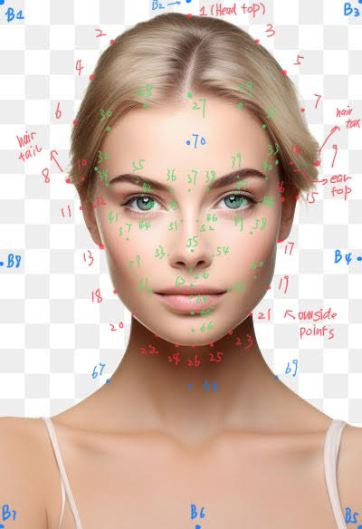

And the result of annotation is shown below:
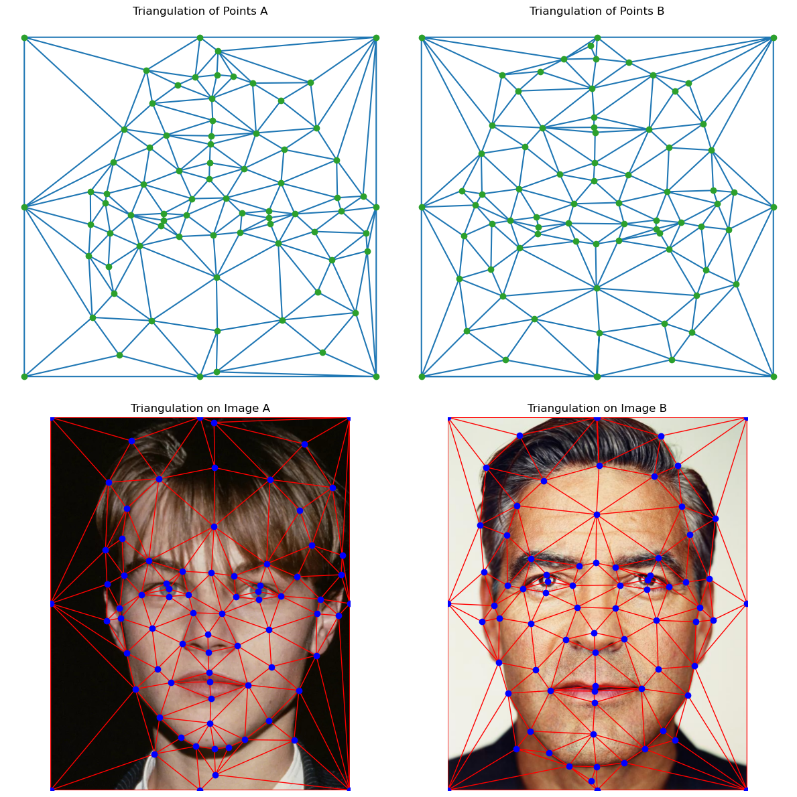

The triangles are computed using `scipy.spatial.Delaunay` where it aims to maximize the smallest acute angle in each triangle. 

We find the mean face by computing the mean of keypoints:

$$
\text{mean$\_$keypoints} = \frac{1}{2}(\text{keypoints$\_$A} + \text{keypoints$\_$B})
$$

The result of the mean shape:

Since this process is particularly inefficient and tedius, I decide to implement an automatic keypoint annotation model. Check Bells and Whistles for details.

## Part 2 Computing the "Mid-way Face"

In this part, I implemented the `computeAffine` function which, given a list of triangles (obtained from the triangulation in last part) of the original image, and the triangles of the target image, we compute the affine transformation matrix $A$ such that $AP = Q$, where $P$ is the triangles position matrix ($3\times3$ in homogenous coordinate), and Q is the target triangles stacked. $A$ is an affine transformation, and therefore
$$
A = \begin{bmatrix}
a&b&c\\ d&e&f\\ 0&0&1
\end{bmatrix}
$$
and
$$
A\begin{bmatrix}
p^1_x&p^2_x&p^3_x\\
p^1_y&p^2_y&p^3_y\\
1&1&1
\end{bmatrix} = \begin{bmatrix}
q^1_x&q^2_x&q^3_x\\
q^1_y&q^2_y&q^3_y\\
1&1&1
\end{bmatrix}
$$
This implies that 
$$
\begin{bmatrix}
p^1_x&p^1_y&1&0&0&0\\
0&0&0&p^1_x&p^1_y&1\\
p^2_x&p^2_y&2&0&0&0\\
0&0&0&p^2_x&p^2_y&1\\
p^3_x&p^3_y&1&0&0&0\\
0&0&0&p^3_x&p^3_y&1\\
\end{bmatrix}\begin{bmatrix}
a\\b\\c\\d\\e\\f
\end{bmatrix} = \begin{bmatrix}
q^1_x\\q^1_y\\q^2_x\\q^2_y\\q^3_x\\q^3_y
\end{bmatrix}
$$

In `computeAffine`, we solve for the coefficients for each corresponding two triangles, and store them in a list. Then, I implement `applyAffine` that does the following algorithm:

1. Create a meshgrid of $x$-$y$ values, representing the indices of each pixel of the target image. Convert all numbers to the homogeneous coordinate.
2. Apply the inverse transform of the affine matrix for each pixel to find the location where it originates before affine transform, effectively avoiding holes. Here, we actually use vectorized code to enhance speed.
3. Use bilinear interpolation for each value that lies between pixels. 

The, implement the wrap method as follows

1. Compute the triangle masks for each triangle in the target image, using `skimage.draw.polygon`. We increase each triangle to be 5% larger (outwards) to create an overlap among triangles and avoid visible boarders.
2. Get the affine transformations from original image to the target.
3. For each triangle,
    apply the affine transformation on the image, then mask the result with the corresponding triangle mask. Then, use a boolean matrix to override the corresponding portion of the output image.

The result pf `image A` and `image B` wrapped to their mean shape is

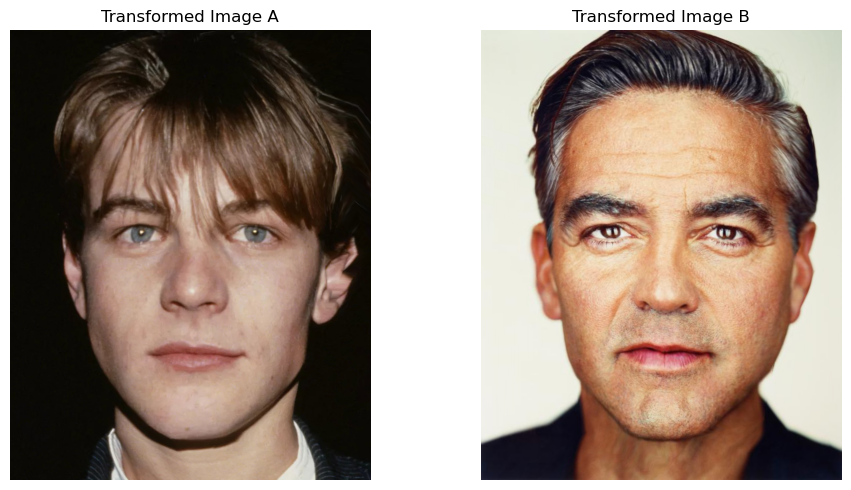

and their averaged mean face is

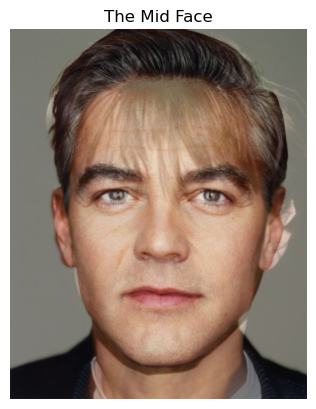

### Part 3 The Morph Sequence

In this section, we create a sequence of image morphing and get a smooth transition from `image A` to `image B`. 

To do this, given total timesteps $n$, and at time $t$, we compute a wrap coefficient $\phi$ and dissolve coefficient $\rho$ to be $\frac{t}{n-1}$, then, compute the target face to be 
$$
I_M = (1-\phi)\cdot I_A + \phi\cdot I_B
$$
Then, we wrap each image to this middle image, egtting $I_A'$ and $I_B'$, and mix them according to
$$
I = (1-\rho)\cdot I_A' + \rho\cdot I_B'
$$
In this case, at time step 0, the result will be purely `image A`, and time $\frac{n}{2}$, it will be the middle face, and at $n-1$, it will be the `image B`, effectively morphing from A to B.

I collect results for all timesteps (`n=45`) in order, and play them using `fps=30`, and here's the video:

### Part 4 The 'Mean Face' of a Population

In this section, we will work on this [dataset](https://web.archive.org/web/20210305094647/http://www2.imm.dtu.dk/~aam/datasets/datasets.html) with annotated facial keypoints. Some example keypoints are shown below

(I add 12 extra points to better wrap the backgrounds)

Again, I compute the mean shape of all the points and do a triangulation on that, then, wrap all images to this mean shape. Some examples are

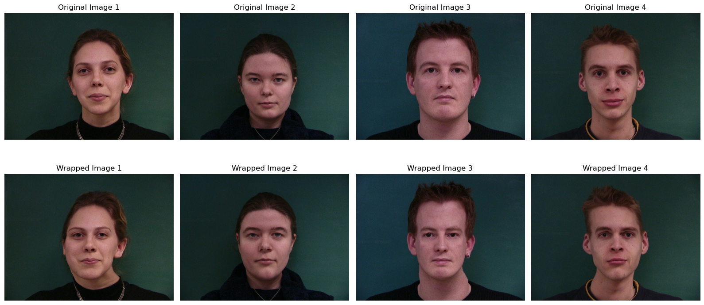

After all images are wrapped to the same shape, we can compute the mean face:

Notice that the skin is smooth, and that's because all the inperfections of the individuals are smoothed out in average.

Now, we annotate the previous used photo of Leonardo (using the automatic annotation model I implement in Bells and Whistles),

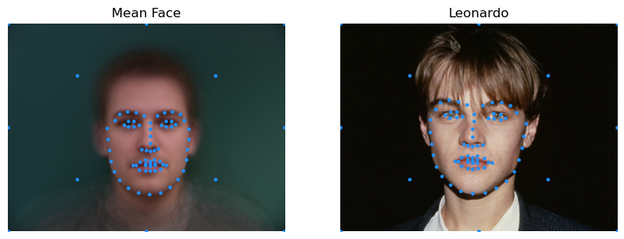

Wrapping the meanface to leonardo gives

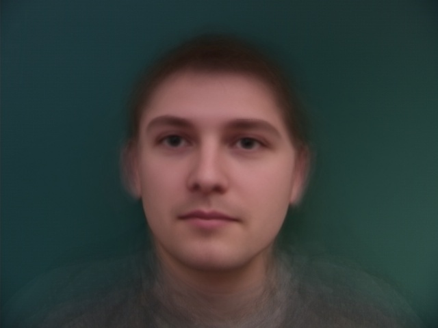

Wrapping leonardo to the meanface gives

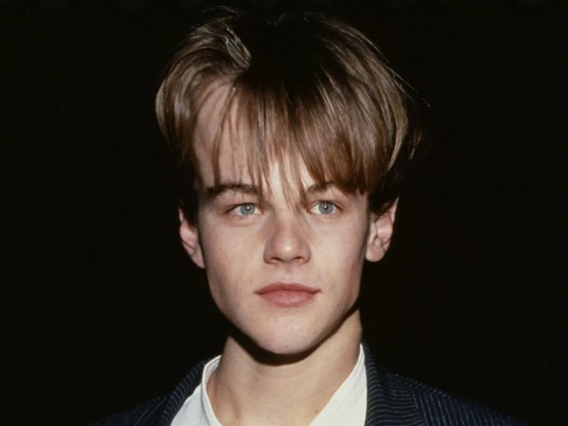

### Part 5 Extrapolation

We can enhance the feature of the leonardo's face using the formula `enhanced = inverse_wrap((1-alpha)*mean_face + alpha*wrapped_leonardo)`. When `alpha > 1`, this is effecively adding the difference between wrapped leonardo and the mean face multiplied by `alpha - 1` to the wrapped leonardo, and then wrap it back to leonardo's geometry. And when `0 < alpha < 1`, it's making leonardo more towards the mean face. Here're some results:

Notice that the enhancing effect is not obvious, and that's because in this picture of leonardo, he actually looks very similar to the mean face in geometry. Therefore, only color enhancement is obvious. In the Bells and Whistles section, I will try more contrasting mean faces.

### Bells&Whistles

#### Change Gender

##### Change Gender

To manipulate with the gender, I do the same thing in part 5 by first wrapping the target to a mean women face, then enhance towards the women side, and then wrap it back. As an example, I make the picture of George more like Japanese women:

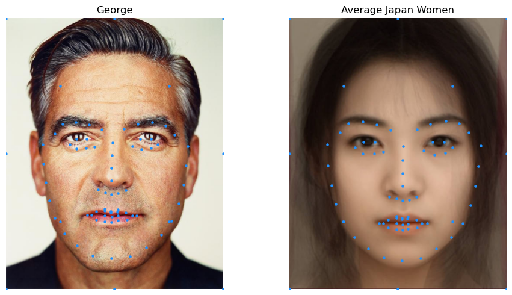

Wrapped towards each other gives,

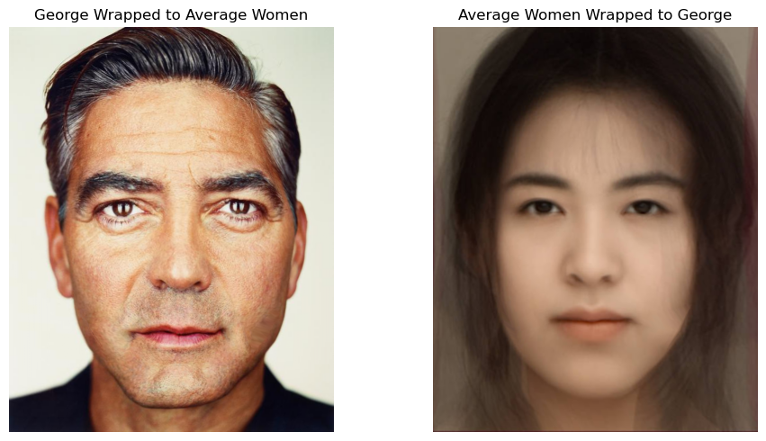

The results of enhancing George towards the feminine side and the masculine side,

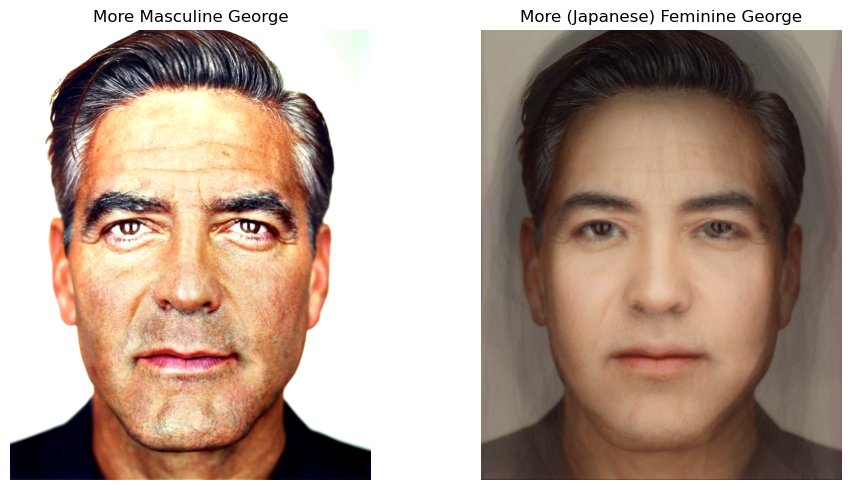

#### Automatic Facial Keypoint Detection Using Neural Nets

In my journey of this project, I find it most painful and boring to manually annotate the points of the face. To correctly wrap two images, both the number of keypoints and the order of the keypoints must be the same. To better address this problem and more conveniently annotate the facial keypoints, I use a convolutional neural network to learn on the [300W dataset](http://dlib.net/files/data/) with around 7000 images and each has 68 keypoints.

Some example keypoints are (these keypoints are annotated labels given along with the dataset)

(The images are converted to grayscale after data-preprocessing)

I use the Xception net introduced in [this paper](https://arxiv.org/abs/1610.02357), and a brief visualization of the net is

I follow some guidelines from [this repo](https://github.com/braindotai/Facial-Landmarks-Detection-Pytorch/tree/master) and [this paper](https://cs231n.stanford.edu/reports/2016/pdfs/010_Report.pdf).

To better generalize on other images, I use data augmentation by randomly rotate, crop, and offset.

##### Result on the 300W Dataset

After training 50 epochs on the 300w dataset, the model is capable to annotating facial landmarks with 68 points:

At the beginning, the model gives completely random predictions

After a few epochs, it starts to learn facial patterns and generates points that look like a face, but not entirely accurate:

After 30 epoches, the model is capable of predicting almost accurate results on most images:

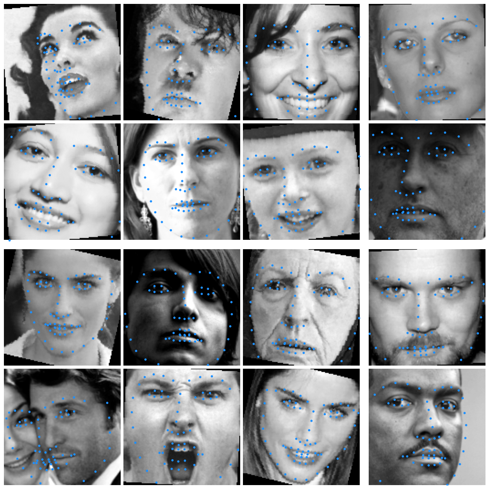

##### Transfer Learning on Dane's Dataset

After we have the capable mode, we can do cools things like reannotate the Dane dataset we used in Part 4, and since 300w dataset has 68 keypoints, it actually provides smoother keypoints on facial landmarks and better morphing performance. Here are some examples of re-annotated Dane datasets:

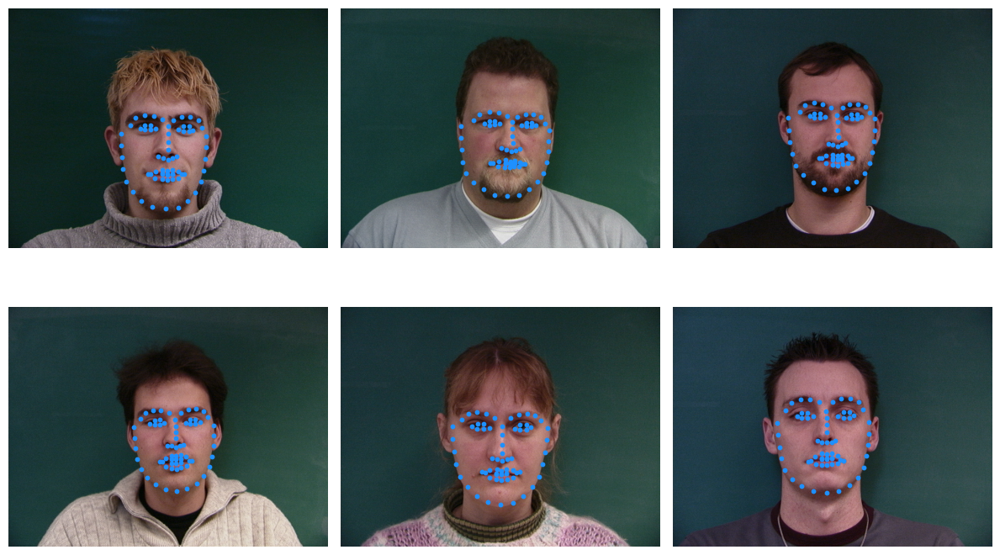

and the mean face computed using this new annotation:

However, if we want to stick with the original number of keypoints, we can use a trick to convert our learned, 68-keypoints model to 57-keypoint model that fits the dane's format. The reason we cannot directly train on Dane is that it's too small (37 images) to get good results. So we do training on 300w first and we remove the fully-connected layer that converts `hidden_dim=1024` to `output_dim=2*68`, and instead make it `nn.Linear(1024, 2*57)`. Then, we freeze the convolutional networks to keep the learnt weights save, and only learn the last fully connected layer. This is called transfer learning.

After doing this for 30 epochs on the Dane dataset, we have a model that predicts keypoints in Dane's format, and here are some comparison between original keypoints and predicted keypoints:

##### Image Facial Annotation

We can also use the model to annotate each frame in a video:

##### Face Swap

TODO

