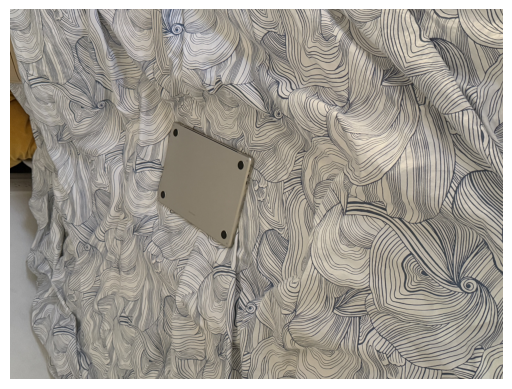
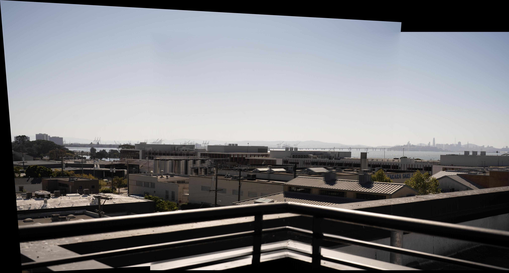

## Part 1 Shot the pictures

I shot 6 images using a sony A7R4 camera with a 50mm len and a tripod. I ensured that each photo has about 40% of overlapped area and can find corresponding points in each image.
Here are the images for demonstration:

## Part 2: Recover Homographies
I used the tool I implemented in project 3 to select 10 correspondance points between the third and the forth images, and here are the points:

Now, given the corresponding points in the homogeneious system
$$
p = \begin{bmatrix}p_x^{(1)}\\ p_y^{(1)}\\1\end{bmatrix} \quad q = \begin{bmatrix}q_x^{(1)}\\ q_y^{(1)}\\1\end{bmatrix}
$$
and the homography matrix 
$$
H = \begin{bmatrix}h_1&h_2&h_3\\ h_4&h_5&h_6 \\h_7&h_8&1\end{bmatrix}
$$
We have
$$
Hp = \begin{bmatrix}
p_x^{(1)}h_1+p_y^{(1)}h_2+h_3\\
p_x^{(1)}h_4+p_y^{(1)}h_5+h_6\\
p_x^{(1)}h_7+p_y^{(1)}h_8+1
\end{bmatrix}
$$
Since we are in the homogeneous system, we should divide the first 2 component by the third to get the normalized value in the cartesian coordinate, and equate that to the target points:
$$
\begin{cases}
\frac{p_x^{(1)}h_1+p_y^{(1)}h_2+h_3}{p_x^{(1)}h_7+p_y^{(1)}h_8+1} = q_x^{(1)}\\
\frac{p_x^{(1)}h_4+p_y^{(1)}h_5+h_6}{p_x^{(1)}h_7+p_y^{(1)}h_8+1} = q_y^{(1)}
\end{cases}
$$
Simplifing this gives:
$$
\begin{cases}
p_x^{(1)}h_1+p_y^{(1)}h_2+h_3+ 0h_4 + 0h_5 + 0h_6 - q_x^{(1)}p_x^{(1)}h_7 - q_x^{(1)}p_y^{(1)}h_8 = q_x^{(1)}\\
0h_1 + 0h_2 + 0h_3 + p_x^{(1)}h_4+p_y^{(1)}h_5+h_6 - q_y^{(1)}p_y^{(1)}h_7 - q_y^{(1)}p_y^{(1)}h_8 = q_y^{(1)}
\end{cases}
$$
which further suggests
$$
\begin{bmatrix}
p_x^{(1)}&+p_y^{(1)}&1&0&0&0&-q_x^{(1)}p_x^{(1)}&-q_x^{(1)}p_y^{(1)}\\
0& 0&0&p_x^{(1)}&p_y^{(1)}&1&-q_y^{(1)}p_y^{(1)}&-q_y^{(1)}p_y^{(1)}
\end{bmatrix}\begin{bmatrix}h_1\\h_2\\h_3\\h_4\\h_5\\h_6\\h_7\\h_8\end{bmatrix} = \begin{bmatrix}q_x^{(1)}\\ q_y^{(1)}\end{bmatrix}
$$

Therefore, to solve for $H$ that accomodates for each $p,q  $, we integrate all the points into the matrix
$$
A = \begin{bmatrix}
p_x^{(1)}&+p_y^{(1)}&1&0&0&0&-q_x^{(1)}p_x^{(1)}&-q_x^{(1)}p_y^{(1)}\\
0& 0&0&p_x^{(1)}&p_y^{(1)}&1&-q_y^{(1)}p_y^{(1)}&-q_y^{(1)}p_y^{(1)}\\
\vdots&\vdots&\vdots&\vdots&\vdots&\vdots&\vdots&\vdots\\
p_x^{(N)}&+p_y^{(N)}&1&0&0&0&-q_x^{(N)}p_x^{(N)}&-q_x^{(N)}p_y^{(N)}\\
0& 0&0&p_x^{(N)}&p_y^{(N)}&1&-q_y^{(N)}p_y^{(N)}&-q_y^{(N)}p_y^{(N)}
\end{bmatrix}
$$
and
$$
b = [q_x^{(1)}, q_y^{(1)}, \cdots, q_x^{(N)}, q_y^{(N)}]^{T}
$$
and solve $Ah = b$ using the least squares solver. 

Using this approach, we are able to find the $H$ that transform `pt1` to `pt2` effectively.

Transform `para_3` to the points in `para_4` gives the following image:

## Part 3: Rectification

To ensure that our homography works correctly, we can try to rectify an image with a known rectangular object to standard rectangular. Here's a photo of my laptop on my bed. 

Due to perspective, it's not standardly rectangular. We can use homography to correct it:

Here's another example of rectification on the moffit library image:

## Part 4 Panorama Blending

Now, given image 1 and image 2, we can use the computed homography to wrap `img1` perspectively to the plane `img2`, but we still need to blend the two images to create a seamless panorama.

Here are the steps to achieve this process:

1. Compute the homography $H$ from `pts1` and `pts2`

2. Transform the corner points of `img1` to get the position of `img1` in the plane of `img2`. Use this to get the new canvas size and compute the translation `T` needed to move the images to the new coordinate.

3. Use `T` and `H` to wrap `img1` onto the plane of `img2`

4. Use threshold masking to find the mask of `wrapped_img1` and `wrapped_img2` respectively.

5. Compute the alpha masking using distance to the background. Here's one example:

6. Use the algorithm from project 2, with the distanced alpha as the mask, to blend the images using multi-band blending.

Here's the result of combining `para_3` and `para_4`:

And here's the full panorama of combining all 6 images together:

And the panorama in the moffit library:

The panorama for the coast in Maine (merged 3 photos):

# Bells & Whistles:

## 3D Rotational Model

Assume the focal length \(f\) is fixed, and the image is captured by purely rotating about the optical center. Under this assumption, we can model the scene such that the points in the images can be aligned using a purely 3D rotation. This simplification reduces the degrees of freedom in our model, making the computation more robust and efficient.
Specifically, we compute the homography using the formula
$$
H = KRK^{-1}
$$
where \( K \) is the camera intrinsic matrix and \( R \) is the rotation matrix. The camera intrinsic matrix is typically defined as
$$
K = \begin{bmatrix}
f & 0 & c_x \\
0 & f & c_y \\
0 & 0 & 1
\end{bmatrix}
$$

Since I use a full-frame camera with a 50mm lens and the image has resolution \((H, W)\), we can compute the focal length by
$$
\text{pixel}_x = \frac{\text{SensorSize}_w}{W} \quad \text{pixel}_y = \frac{\text{SensorSize}_h}{H}
$$
$$
f_x = \frac{50}{\text{pixel}_x} \quad f_y = \frac{50}{\text{pixel}_y}
$$
$$
c_x = \frac{W}{2} \quad c_y = \frac{H}{2}
$$
This accounts for \( K \).

To find \( R \), we can use the Kabsch algorithm on the camera-intrinsic-normalized \( \text{pts1} \) and \( \text{pts2} \). That means, we first normalize \( P \in \mathbb{R}^{N \times 3} \) and \( Q \) by \( \bar{P} = (K^{-1}P^{T})^{T} \), and similarly for \( \bar{Q} \), because the homography \( H = KRK^{-1} \) performs the camera normalization first.

Then, we want to find the rotation \( R \) that minimizes the cross-correlation between \( \bar{P} \) and \( \bar{Q} \). From linear algebra, we know that this involves performing the singular value decomposition (SVD) of the covariance matrix formed by the normalized point sets \( \bar{P} \) and \( \bar{Q} \). By decomposing this covariance matrix, we obtain the matrices \( U \), \( \Sigma \), and \( V^\top \), which are then used to construct the optimal rotation matrix \( R \) as
$$
R = V U^T.
$$
We aim to find the rotation matrix \(R\) that minimizes the cross-correlation between \(\bar{P}\) and \(\bar{Q}\). From linear algebra, this involves performing the SVD of the covariance matrix formed by the normalized point sets (\bar{P}^T\bar{Q}\). By decomposing this covariance matrix, we obtain the matrices \(U, \Sigma, V^T\), which are then used to construct the optimal rotation matrix \(R\)as:
$$
R = VEU^T
$$
where \(E = \mathrm{diag}(1,1,\det(VU^T))\)
This rotation matrix aligns the points in \(\bar{P}\) with those in \(\bar{Q}\) by minimizing the alignment error.

Here are the results of using rotational model to align `para_3` and `para_4`:

It's obviously that there are less distortion on the left region.

Here's also the rotational result of merging two images about the maine coast:

The alignment is more defective because I wasn't using a tripod when taking these photos. 

