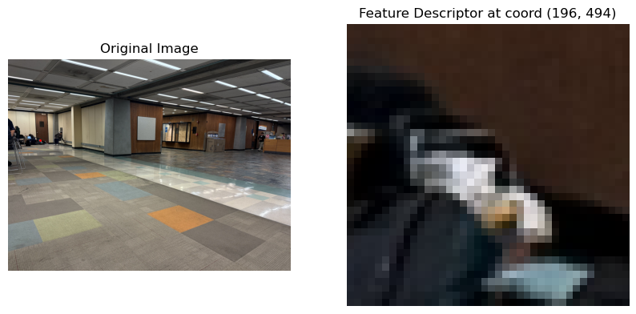
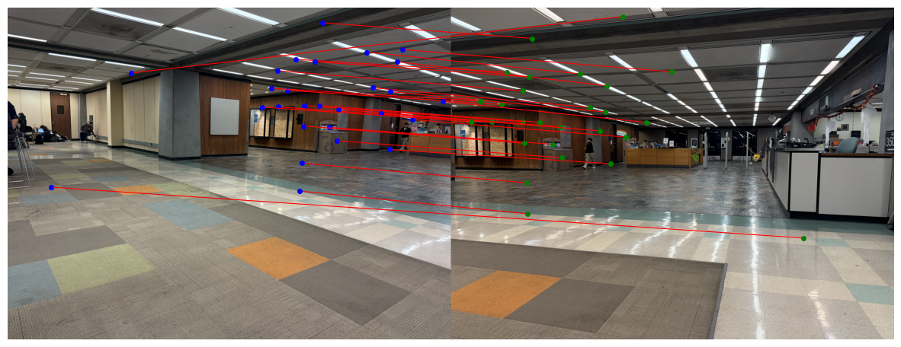
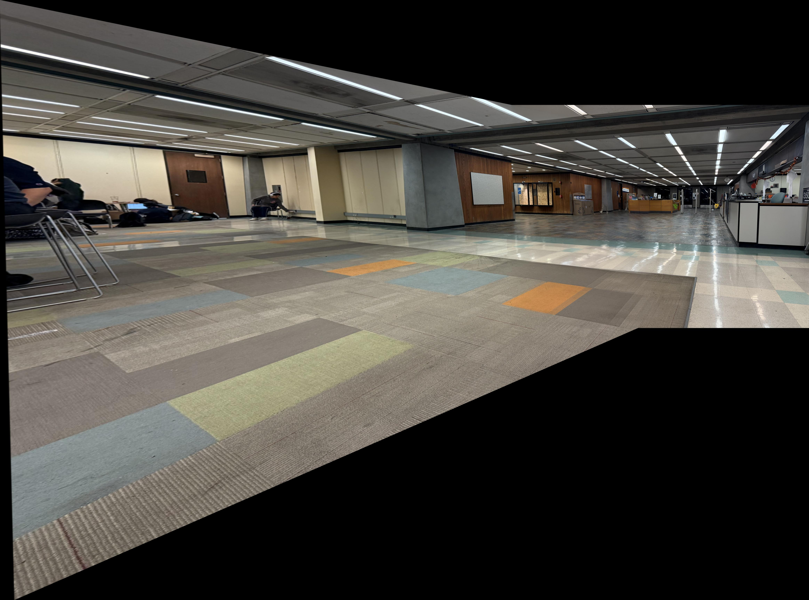
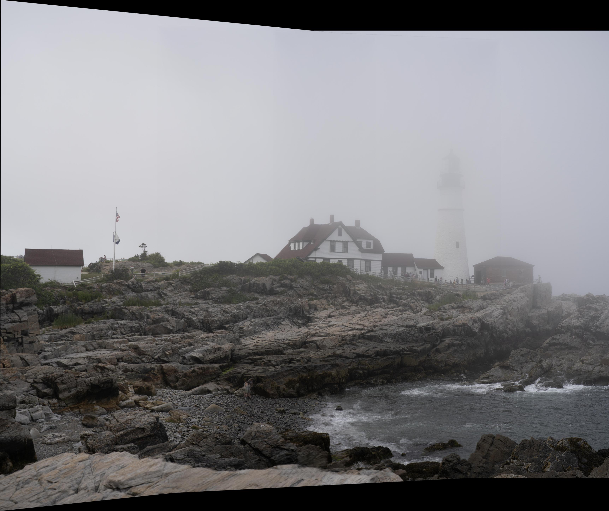
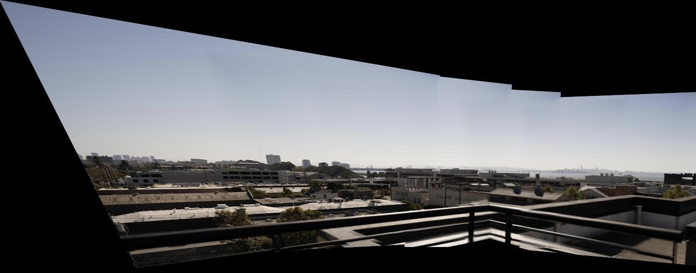
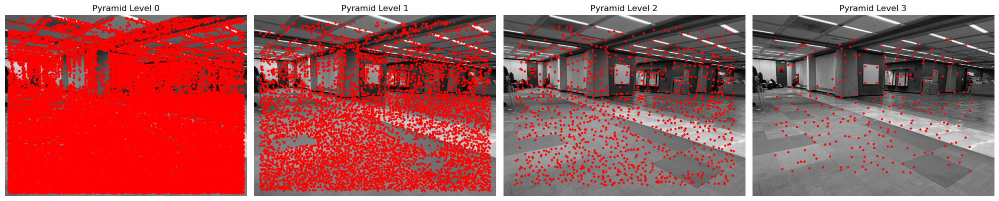
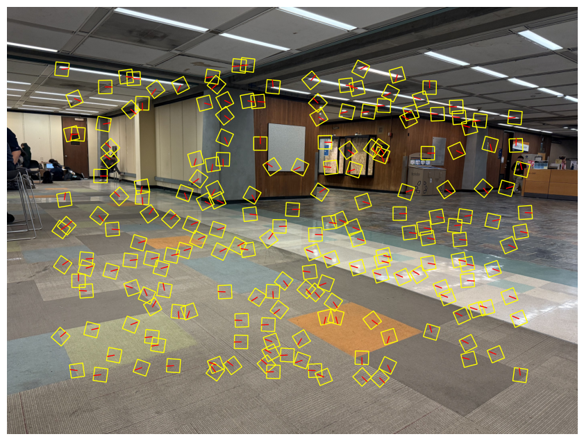
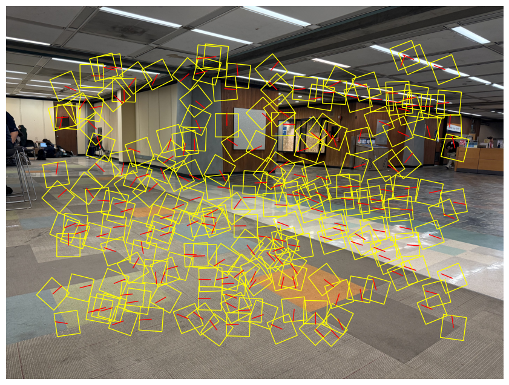
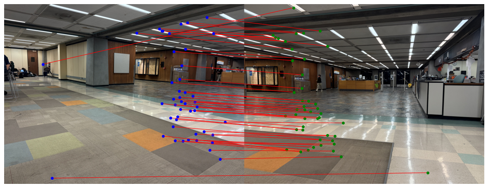

## CS180 Project 4 Part B

## Automatic Panorama Creation 

### Introduction

In the last section, we annotate keypoints by hands and use them to compute the homography matrix $H$ and wrap one image to the plane of the other.
In practice, this process is both tedious and inaccurate. When selecting points from a small window using pointers, we can accidentally select points that drift by a few pixels, leading to non-exact matchings.

In this project, I will build a pipeline to automate this process of keypoints annotation and build matchings between two images we intend to merge.

### Harris Corner Detector

For the initial search of interest points, we use the harris corner detector which, as its name suggests, search points that are at the "corners." Given window size $w$, image $I(x,y)$, we:

1. Apply gaussian blur with $\sigma_b$, then find the derivative w.r.t $x$ and $y$, respectively $I_x$ and $I_y$.
2. Find $I_{xx} = I_x^2$, $I_{yy} = I_y^2$, $I_{xy} = I_xI_y$. 
3. Given point $(u,v)$, the sliding window $\mathcal{W} = [u - w/2:u+ w/2, v - w/2, v+w/2]$. Compute $S_{xx} = \sum_{(x,y)\in \mathcal{W}}I_{xx}$, $S_{yy} = \sum_{(x,y)\in \mathcal{W}}I_{yy}$, $S_{xy} = \sum_{(x,y)\in \mathcal{W}}I_{xy}$.
4. For each (u,v), compute the harris response $h = \frac{S_{xx}S_{yy} - S_{xy}^2}{S_{xx}S_{yy}}$.
5. Find all points such that the harris response is above the threshold.

Here's the result of running harris corner detection on the images of moffit libraries, where I also applied a non-maximum filtering with kernel size of 10 pixels and discard 20 pixels near the edge. 

### Adaptive Non-maximum Suppression

There are too many points in the results of harris corner detection, and in many cases, a very distinctive corner may have many detected points around it. We somehow want the points to be more evenly distributed. The algorithm of adaptive non-maximum suppression aims to preserve points that are the local max of its region and filter out the less representative ones. Here's the algorithm description using a KD Tree:

1. Given harris responses: `coords` (N,2) and the corresponding response values `h` (N,1), we sort the coords in reversed order according to $h$.
2. Maintain a radii recorder for each point in `coords` that represents the maximum radius such that this point has the strongest harris response within the circle of this radius.
3. Initialize an empty KD tree. 
4. For each point in the sorted array, if it's the first element, mark its radii as `inf` and insert it into the KD tree. For later points, we query the tree the distance to its nearest neighbor, `r`, and make it the radii of that point. Then, we insert the point into the tree. (The reason this works is because at any time, the tree only has points with stronger response than the point being queried)
5. Sort the `coords` according to their radii, and take the first `n_points` coords.

Here's the result of running ANMS on the moffit pictures. It's obvious that the points are pretty evenly distributed. I only took 500 points.

### Feature Descriptor Extractor

Then, we need a way to effectively compare the keypoints in two images in order to find best matches. Here, for each point in the ANMS result, I took a $40\times 40$ patch around that pixel, apply a low-pass filter and then resize it to a $8\times 8$ patch. Then, I flattened it and normalize it by its mean and variance. This creates a feature descriptor for the interest point. Here are some patches before the resize and normalization for visualization purposes:

### Feature Matching

After deriving the feature descriptors for both images, we need to establish correspondences between the points in the two images. Here, I estimate the similarity between two patches by computing the $l_2$ distance between the two descriptors. The algorithm description is:

1. Create two KD Trees respectively for `descriptors1` and `descriptors2`. And two arrays keeping track of the best matches.
2. For each descriptor in `descriptors1`, query the `KDTree2` about its nearest neighbor in image 2 `(nn1, d1)` and the second nearest neighbor `(nn2, d2)`. Then, we only append `nn1` to the best matches for image 1 if:
   - (1) `d1` $<$ `thresh_abs`. That means the two patches are similar enough
   - (2) `d1/(d2+1e-6)` $<$ `thresh_ratio`. This is used to implement Lowe's ratio test that we take the point only when the nearest neighbor is much better than the second to best. 
   We do the same for each descriptor in `descriptors2`.
3. For the matching results in `match1` and `match2`, we add a pair `(pt1, pt2)` to the final result if the best match of `pt1` is `pt2` and vice versa. This means that we only accept double selection. 

Here's the result when I set `thresh_abs=5` and `thresh_ratio=0.7`. We have 27 matches, and it's notable that the outliers have dramatically decreased and most points look like good matchings.

### Random Sample Consensus (RANSAC)

However, even after all these procedures, there are still outliers existing in the matchings, and it's risky if we just compute the homographies using all of them. To address this issue, I used the RANSAC algorithm to create a much more robust homography `H`. The algorithm follows the guidelines below:

1. The algorithm has inputs `matching` (result from last step), `n_loop` (number of iteration loops to run), `epsilon` (criterion for determining if a point is an inlier or an outlier)
2. Initialize `best_H` to be the trivial $3\times 3$ matrix, and the `inliers` to be an empty array.
3. Repeat for `n_loop` times, each time we randomly pick 4 points, without replacement, from `matching`, and solve an exact homography `H` using these points. Then, we transform points from $I_A$ using `H`, and compute the $l_2$ distance between transformed points and the matching points in $I_B$. Record the points such that the distance is smaller than `epsilon`, call them inliers.
4. If the number of inliers of this round is larger than the number in the global `inliers`, we change the global pointer to both the inliers and `H` from this round.
5. After all iterations, recompute `H` using the final set of `inliers`, and return `H`. 

### Panorama Stitching

Finally, with the `H` derived from RANSAC, we can use the panorama stitching pipeline built in part A to merge two images into a panorama. Here are some comparisons between hand-annotated panoramas and the panoramas created using the pipeline we just introduced:

The roof image (merging 5 pictures) using the automated pipeline:

The roof image using hand annotated keypoints in part A:

### Bells & Whistles: Multiscale Oriented Patches (Scale and Orientation Invariant)

In the paper of [MOPS](https://inst.eecs.berkeley.edu/~cs180/fa24/hw/proj4/Papers/MOPS.pdf), the author proposed the method of keypoint matching that is invariant to both scale and orientation. In this project, I also implemented this pipeline.

#### Multiscale Harris Detection

In the multiscale harris detection, we detect harris corners on different scales of the image across a pyramid to be robust to scale variations. At each layer, we do the similar detection as a single layer harris detection, but this time, for each interest point, we also fit the points around the interest point (with `w_size=3`) and their harris responses to a 2D quadratic function, and use least squares to find the minima. We use this technique to refine the interest point to subpixel precision for higher computation accuracy. 

It's worthy noting that in order to make the features rotational invariant, we also estimate the dominate orientation of each interest point. Specifically, we find the derivatives of gaussian with width $\sigma_o = 4.5$. Given interest point $(u,v)$, we have:
$$ u = \begin{bmatrix}I_x(u,v)\\I_y(u,v) \end{bmatrix}$$
and 
$$\mathrm{orientation}  = \frac{u}{||u||} = \begin{bmatrix}\cos \theta \\ \sin \theta\end{bmatrix}$$
then
$$\theta = \arctan \frac{u_1}{u_2}$$

Here's a picture showing the orientations under different scales:

(The result displayed above are actually after the ANMS)

#### Multiscale ANMS

Similarly, we run ANMS on each layer of the scale and here are the result:

#### Feature Descriptor Extraction

At each scale level, we still extract a $40\times 40$ patch (at that scale). But to accommodate rotational invariant extracting, given the orientation $\theta$, we take the patch along the dominate orientation and then resize it to the $8\times 8$ smaller patch, flatten and normalize as stated above. Here are some results of the rotated patches(before downsizing and normalizing):

#### Feature Matching

Before running feature matching, we merge the descriptors of all layers into one array of descriptors. Then we run the regular algorithm introduced above.

Here are the matching result of the moffit library:

The matching is very successful and, for the same set of thresholds, there are more matchings in MOPS than the single scale methods discussed above.

After merging the descriptors, we combine interest points of different scales or angles into consideration and allow the algorithm to find the same points under scale or rotation.

Here's one example of running MOPS on the roof images:

And the printing log suggests that the algorithm `find best homography with 141 inliers outof 313 matches`, which is a huge improvement from the previous `23 inliers out of 83 matches` when doing this using regular methods.