## CS180 Project 5 Diffusion Models

## Part A: Inference with Pretrained DDPM

In part A, we will play around the pretrained [DeepFloyd IF](https://huggingface.co/docs/diffusers/api/pipelines/deepfloyd_if) model, a text-to-image model, which takes text prompts as input and outputs images that are aligned with the text. 

### Model Setup

This section is to check that the model is correctly downloaded and deployed. 

After inputing the text prompts `an oil painting of a snowy mountain village`, `a man wearing a hat`,and `a rocket ship`, the model generates the following images:

Note that the smaller images are the $64\times 64$ output from the stage-1 model, and the larger images on the second row are $256 \times 256$ images from stage 2. 

Also to make all results reproducible, I set the random seed to be `3036702335`, which is my SID. 

### A1. Sampling Loops

Starting from a clean image $x_0$, we can iteratively add a small noise $\epsilon_t \sim \mathcal{n}(0, I)$ at time $t$ and after sufficient timesteps $T$, we will get a pure noise image $x_T$. A diffusion model tries to reverse this process by predicting the noise being added at each $t$, and, getting $x_{t-1}$ by subtracting the noise from $x_t$. 

In the DeepFloyd IF model, we have $T = 1000$. 

In this section, we will explore ways to sample from the model. We will use the following test images:

The sather tower:

My roommate's cat, Nunu:

A watermelon wine I made myself:

These images will be resized to $64\times 64$ for standard model input. 

#### A1.1 Implementing the forward process

In the forward process, given timestep $t$, we can iteratively add noise to the image for $t$ times. Usually, this noise-adding behavior is defined as
$$ x_t = \sqrt{\alpha_t} x_{t-1} + \sqrt{1 - \alpha_t} \epsilon_{t-1} $$
where $\epsilon_t$ is standard normal, and $\{\alpha_t\}_{t=1}^T = 1 - \{\beta_t\}_{t=1}^T$, and $\beta_t$ is the variance schedule that controls the variance of the noise being added. However, it can be shown that this formula can be simplified to 
$$x_t = \sqrt{\bar{\alpha}_t} x_0 + \sqrt{1 - \bar{\alpha}_t} \epsilon $$
where $\bar{\alpha}_t = \prod_{i=1}^t \alpha_i$ is the cumproduct of $\alpha_i$. Thus, we have
$$q(x_t|x_0) = \mathcal{N}( \sqrt{\bar{\alpha}_t}x_0, (1-\bar{\alpha}_t)I)$$

In the DeepFloyd Model, the $\bar{\alpha}_t$ are precomputed and stored in `stage_1.scheduler.alphas_cumprod`, so we can implement the forward pass easily. Here are the results of adding noise to the campanile image at timesteps [250,500,750], respectively:

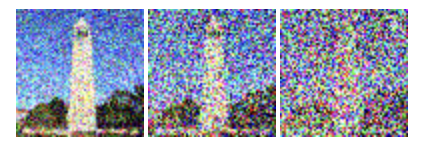

### A1.2 Classical Denoising

One of the most classical way of denoising is the **gaussian blur filter**. Here, we use the filter with kernal size of 5, and here are the results of trying to denoise the noisy images above:

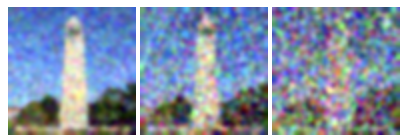

It's obvious that the result is not desirable.

### A1.3 Implementing One Step Denoising

Given the formula above that
$$x_t = \sqrt{\bar{\alpha}_t} x_0 + \sqrt{1 - \bar{\alpha}_t} \epsilon$$
we can try to get from $x_t$ to $x_0$ in one step using the formula
$$x_0 = \frac{x_t - \sqrt{1 - \bar{\alpha}_t} \epsilon}{\sqrt{\bar{\alpha}_t}}$$
where $\epsilon$ is the model's estimate of noise at stage $t$. 

Here are the results of the one-step denoising on the images above:

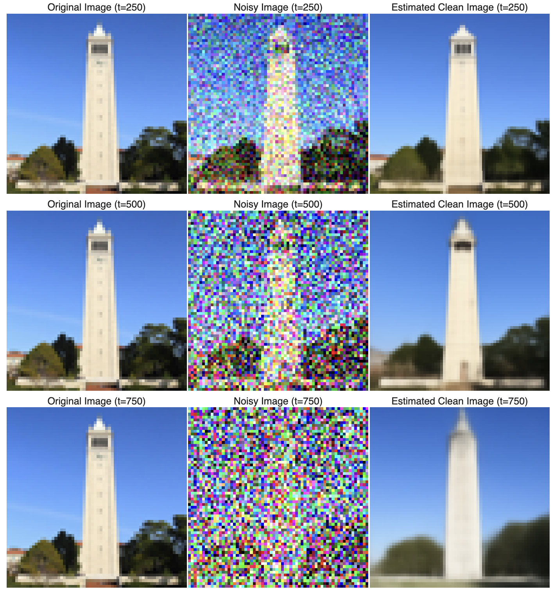

### A1.4 Implementing iterative denoising

From the output of the last section, we see that when $t$ is large, the denoised image is very vague and blur. Intuitively, we just predict the noise once and use the cumprod coefficients to get back to the original image, and it's hard to recover all details in one step. The diffusion model, on the other hand, is designed to iteratively remove noise.

In theory, we should run $x_{999}$ step by step all the way back to $x_0$, but this will be very inefficient. Instead, we take a strided timestemps that is a subset of $\{0, 1, \cdots, 998, 999\}$ and here, I use a stride of 30 and goes from 900 all the way back to 0. 

Now, if `t = strided_timesteps[i]`, and `t' = strided_timesteps[i+1]`, to get $x_{t'}$ from $x_t$, we have

$$x_{t'} = \frac{\sqrt{\bar{\alpha}_{t'}}\beta_t}{1 - \bar{\alpha}_t}x_0 + \frac{\sqrt{\alpha_{t}}(1 - \bar{\alpha}_{t'})}{1 - \bar{\alpha_t}}x_t + v_\sigma$$
where $v_\sigma$ is a random noise also predicted by the model. 

Starting from `i_start=10`, the images of every 5 loop of denoising are:

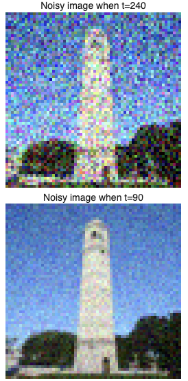

And a contrast between different denoising methods is 

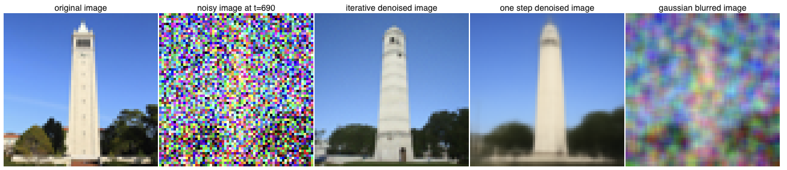

### A1.5 Diffusion Model Sampling

Now, with the iterative denoising loop, we can use the diffusion model to generate images by first creating an image of random noise, then input it into the model and denoise from `i_start=0`. Then, the model will denoise the pure noise in which process a new image is sampled. 

Here are some results of sampling from the current model:

### A1.6 Classifier Free Guidance

In this section, we implement the [classifier-free guidance](https://arxiv.org/abs/2207.12598). In CFG, at each $t$, we compute both a noise estimate, $\epsilon_c$, conditioned on a text prompt, and an unconditional noise estimate $\epsilon_u$. Then, we compute the noise estimate to be
$$\epsilon = \epsilon_u + \gamma(\epsilon_c - \epsilon_u)$$
where $\gamma$ controls the intensity of the CFG. When $\gamma > 1$, we will get high quality images.

Here are some results of sampling when $\gamma = 7$:

It's notable that the images are now much better in quality and essembles a realistic photo under the prompt `a high quality photo`. 

### A1.7 Image-to-image Translation

In part 1.4, we take a real image, add noise to it, and then denoise. This effectively allows us to make edits to existing images. The more noise we add, the larger the edit will be. This allows us to create an image-to-image transition by adding noise of different levels and then denoise. Intuitively, we will create a series of noisy pictures, from pure noise to medium noisy, to slight noisy; then, the diffusion model will create images from completely new, to medium modification, to very slight modification pictures, featuring the image-to-image transition.

Here are the results of this process, given prompt at noise levels [1, 3, 5, 7, 10, 20] in the `strided_timesteps`, on the three test images above:

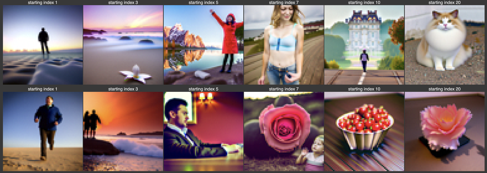

We see that it has very interesting results that initially, the image is completely unrelated to the original image, but gradually it resembles the original ones. 

#### A1.7.1 Editing Hand-Drawn and Web Images

This procedure works particularly well if we start with a nonrealistic image (e.g. painting, a sketch, some scribbles) and project it onto the natural image manifold. In this section, we will experiment on hand-drawn images. I will show the result of one web-downloaded image and two images that I draw myself. Here are the original images:

The image downloaded from [this site](https://i.pinimg.com/originals/76/e5/d5/76e5d55d0c8c6ec65135b42a2c5cbd98.jpg):

The images I draw using Procreate:

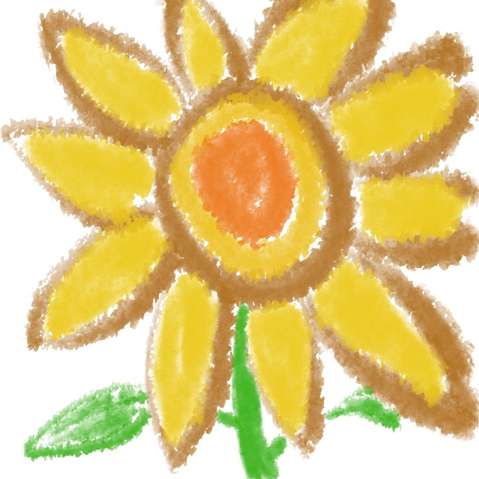

And here are the results of image-to-image transition:

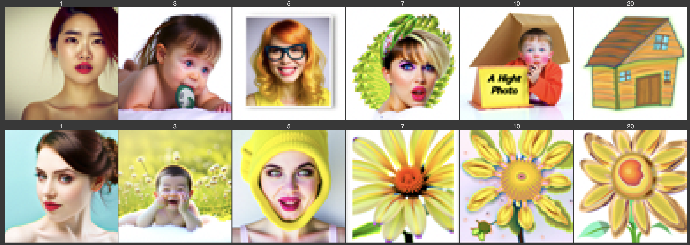

#### A1.7.2 Inpainting

We can use the same procedure to implement [inpainting](https://arxiv.org/abs/2201.09865), that is, given an image  $x_{orig}$ , and a binary mask $m$ , we can create a new image that has the same content where  $m$ is 0, but new content wherever $m$ is 1.

To do this, after each denoising step to obtain $x_t$, we force every pixel outside the editing mask $m$ to be the same as $x_{orig}$. Mathematically, that is

$$x_t \leftarrow mx_t + (1-m) \mathrm{forward}(x_{orig}, t)$$

By doing so, we only make edition on the masked region and keep everything else as original. 

I used the following masks on the three test images:

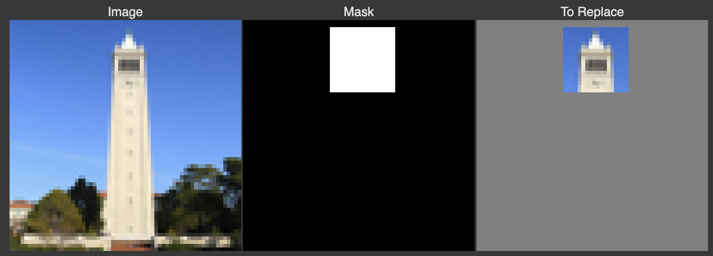

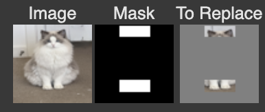

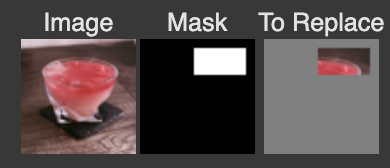

and here are the results, respectively:

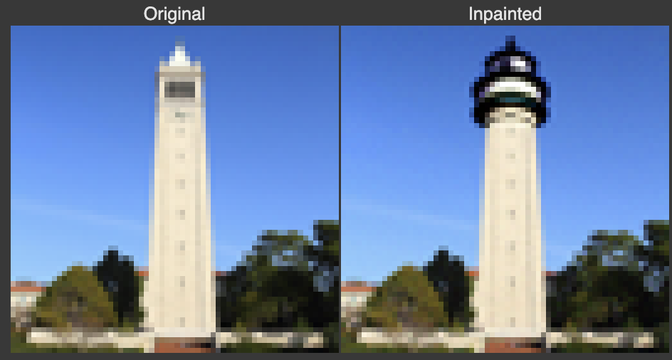

#### A1.7.3 Text-Conditioned Image-to-image Translation

Now, we will do the same thing as the previous section, but guide the projection with a text prompt. This is no longer pure "projection to the natural image manifold" but also adds control using language. This is simply a matter of changing the prompt from `a high quality photo`:

This is the result of `test_im_1` using the prompt `a rocket ship`:

The result of `test_im_2` using the prompt `a sitting tiger`:

The result of `test_im_3` using the prompt `a volcano`:

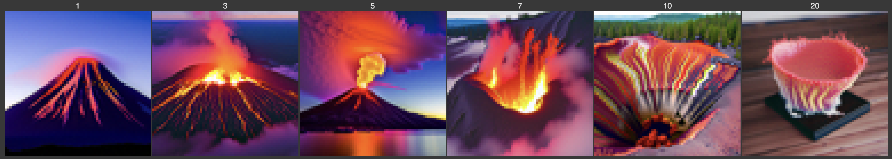

### A1.8 Visual Anagrams

In this section, we implement the [Visual Anagrams](https://dangeng.github.io/visual_anagrams/) that we will create an image that looks like `prompt 1`, but when flipped upside down will reveal `prompt 2`. 

To achieve this, at each step $t$, we compute the noise estimate using this algorithm:

$$
\begin{equation*}
\begin{aligned}
&\epsilon_1 = \mathrm{UNet}(x_t, t, p_1)\\
&\epsilon_2 = \mathrm{flip}(\mathrm{UNet}(\mathrm{flip}(x_t), t, p_2))\\
&\epsilon = \frac{\epsilon_1+\epsilon_2}{2}
\end{aligned}
\end{equation*}
$$
where $\mathrm{UNet}$ is the diffusion model as before, and $\mathrm{flip}$ is the operation to vertically flip the image. Theoratically, I can use other operations like $\mathrm{rotate}$(img, $\theta$) to create anagrams that are not just vertically dual, but here for simplicity, I only attempted vertically flipped anagrams.

Here are some results of creating vertically flipped visual anagrams:
normal: `an oil painting of an old man`; flipped: `an oil painting of people around a campfire`

normal: `an oil painting of a red panda`; flipped: `an oil painting of a kitchenware`
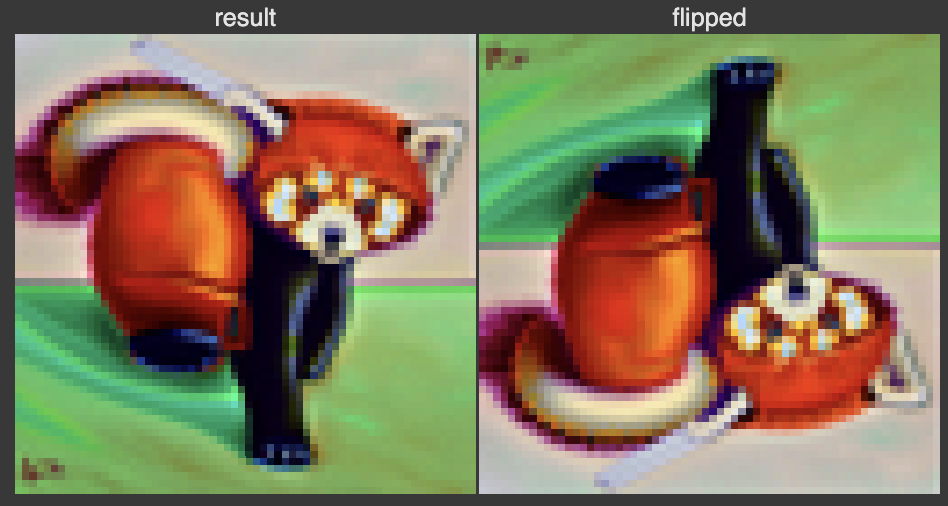
normal: `an oil painting of an old man`; flipped: `an oil painting of a horse`
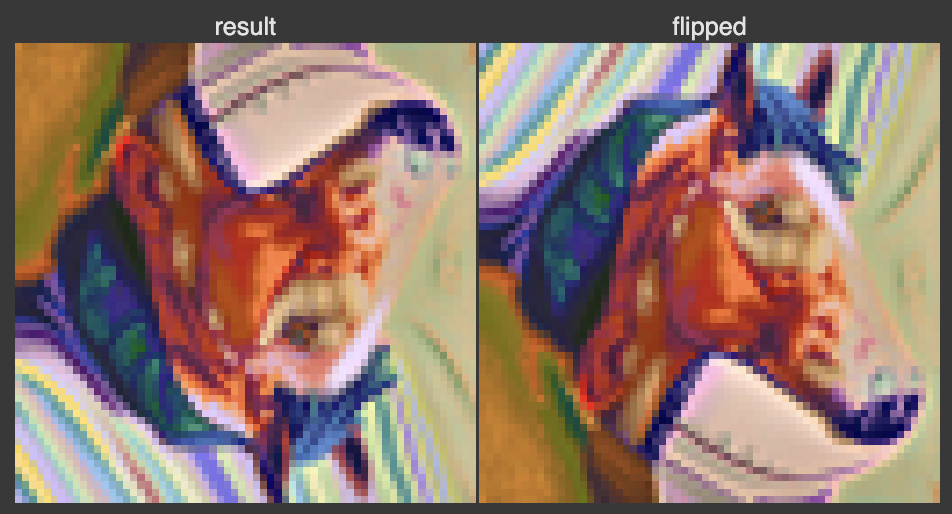

### A1.9 Hybrid Images

In this part we'll implement [Factorized Diffusion](In this part we'll implement Factorized Diffusion and create hybrid images) and create hybrid images that looks like `prompt 1` from a far-away distance, and looks like `prompt 2` at close-up. 

To achieve this, we use this algorithm:

$$
\begin{equation*}
\begin{aligned}
&\epsilon_1 = \mathrm{UNet}(x_t, t, p_1)\\
&\epsilon_2 =  \mathrm{UNet}(x_t, t, p_2)\\
&\epsilon = f_{\text{low-pass}}(\epsilon_1) + f_{\text{low-pass}}(\epsilon_2)
\end{aligned}
\end{equation*}
$$

Here are some results of running this algorithm:
far: `a lithograph of a skull`; close: `a lithograph of waterfalls`

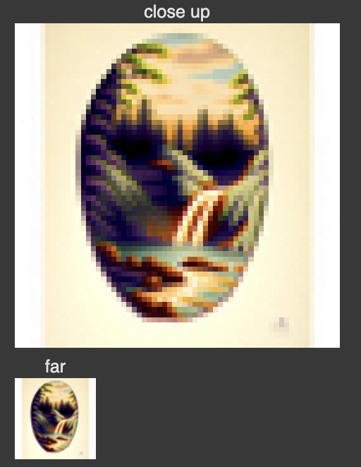

far: `an oil painting of a dog`; close: `an oil painting of landscape`

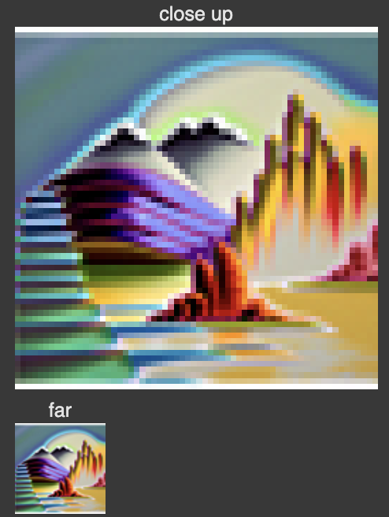

far: `an oil painting with frame of a panda`; close: `an oil painting with frame of houseplant`

## Bells & Whistles Part A:

### Design a course logo:

Using the diffusion model, I create two course logos that I think it looks kind of cool:

prompt: `A futuristic logo with a computer in the middle, and on its screen there's a camera len in the middle to feature computer vision`

prompt: `A logo about a robot with computer vision feature`

### Upsample Test Images

I also attempted the stage 2 of DeepFloyd IF model that does up-sampling to images, and here are the results of running it on the test images:

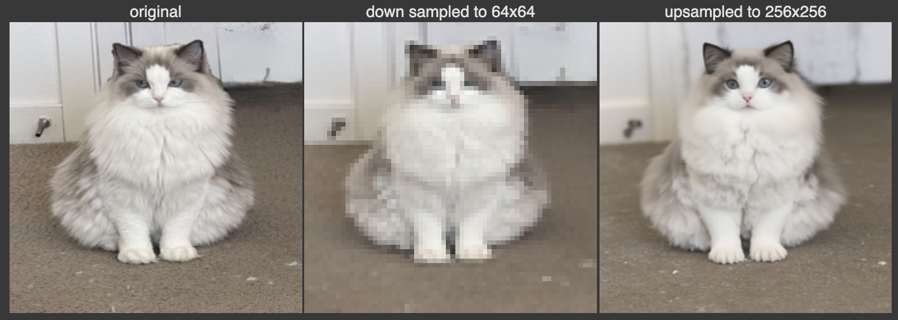

### Text-conditioned Translation on Hand-drawn Images with Up Sampling

I also did a text-conditioned transition on the sketch house I drew, conditioned on the prompt that it's a `high quality photo of a house`, then I up-sampled it using the same prompt. Here are the results

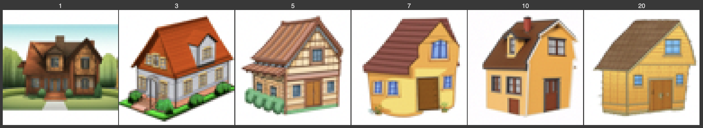

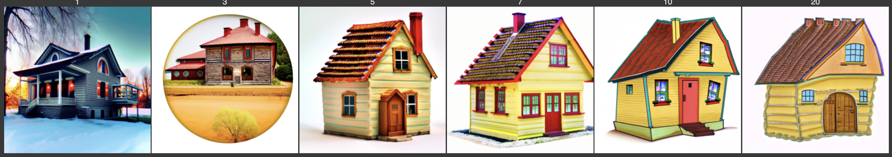

### Cool Image Creation

On the other hand, I attempted to create some fictional cool images using the model and then up-sample it. Here's the result of the prompt `a gigantic robot with a skull face destroying the city`:

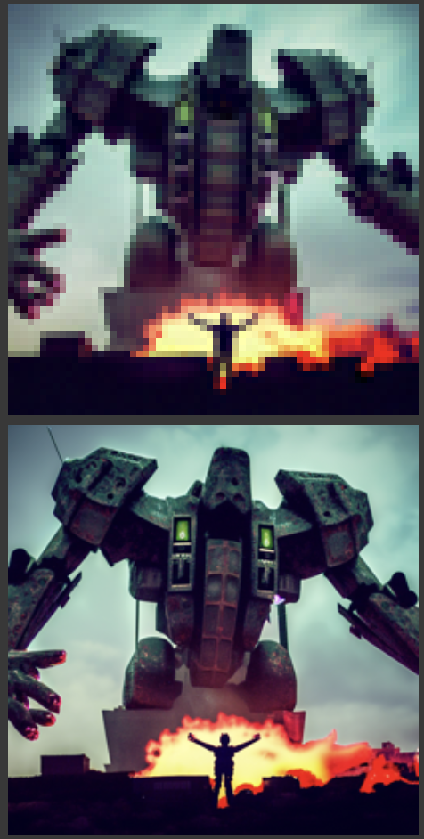

## Part B: DDPM with Customized UNet

### B1 Unconditioned UNet

In this section, I implement the unconditioned UNet following this flow:

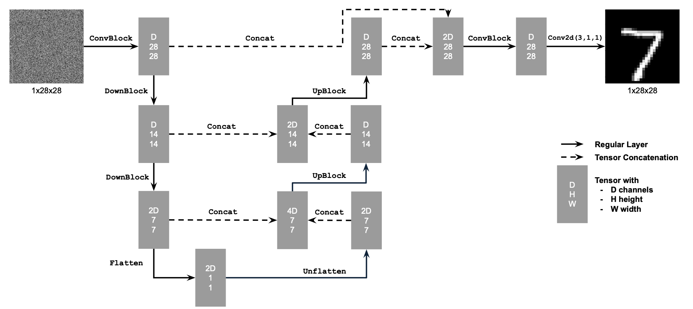

and the elementary blocks are implemented according to 

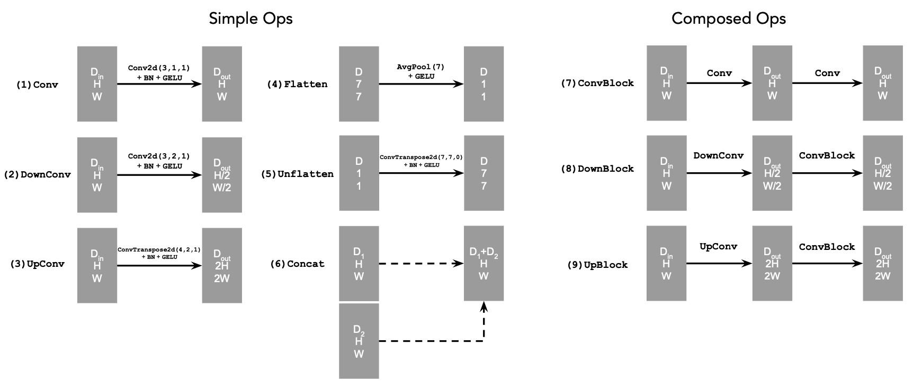

Once we have the UNet, given a noisy image $z = x + \sigma\epsilon$, we can train the UNet to be a denoiser such that 
$$\argmin_\theta \mathbb{E}\left[||\epsilon_\theta(z) -  \epsilon||^2\right]$$

In this project, we play around the [MNIST dataset](https://yann.lecun.com/exdb/mnist/) of hand-written digits. Here are some examples of adding noises of various levels to the images in MNIST:

In the training, we use the noise level $\sigma=0.5$, `hidden_dim=128`, and `lr=1e-4` on Adam. Here are some training data:

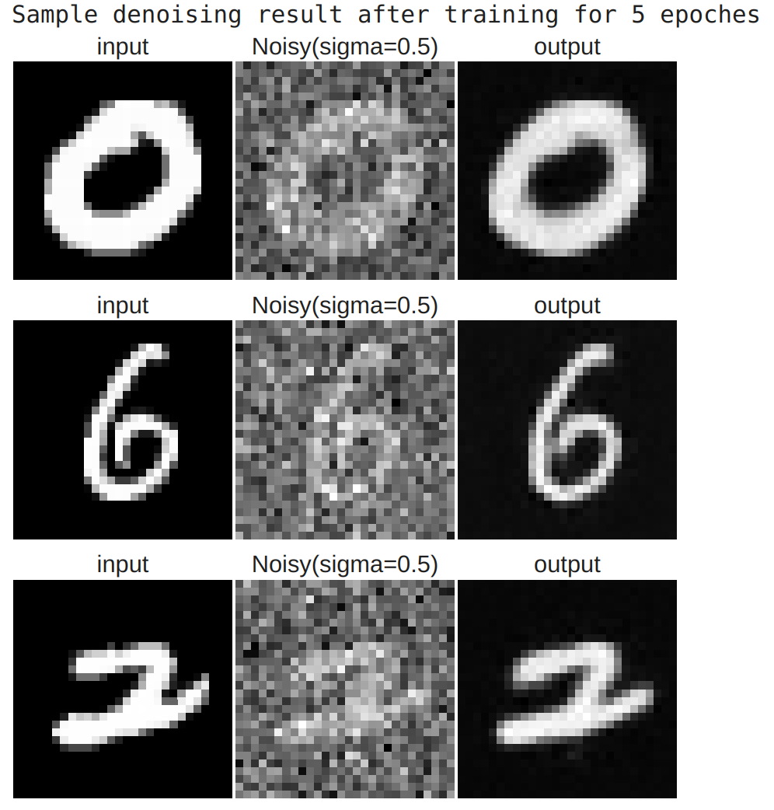

And finally, here's the result of trying to use the model trained at $\sigma=0.5$ to denoise images of various noise levels:

### B2 Diffusion Models

#### B2.1 Time-conditioned DDPM

According to [the DDPM paper](https://arxiv.org/abs/2006.11239), we implement the method similar to the math introduced in A1.1 (insert link here), and we will make a slight modification to our UNet above to allow time-condition when computing the noise:

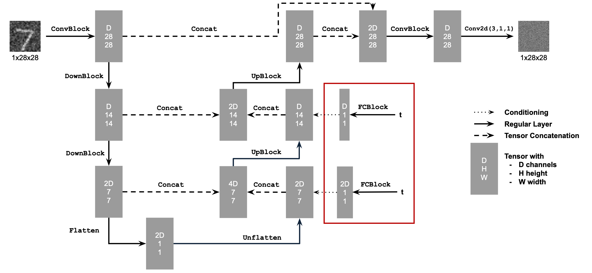

Specifically, we will add the embedded time vector to the layers circled in the architecture plot.

Training of the model follows 

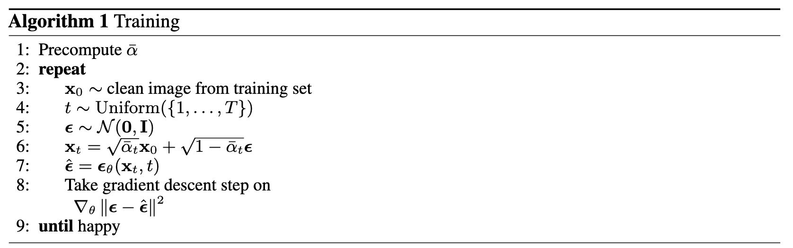

and sampling follows this algorithm

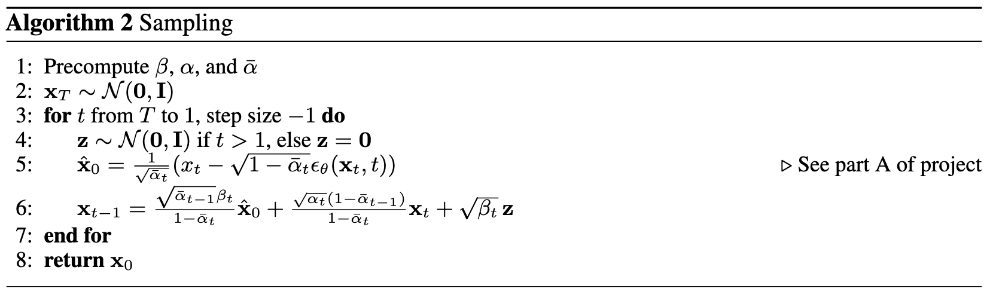

Here are some samples after `epoch=5` and `epoch=20` respctively:

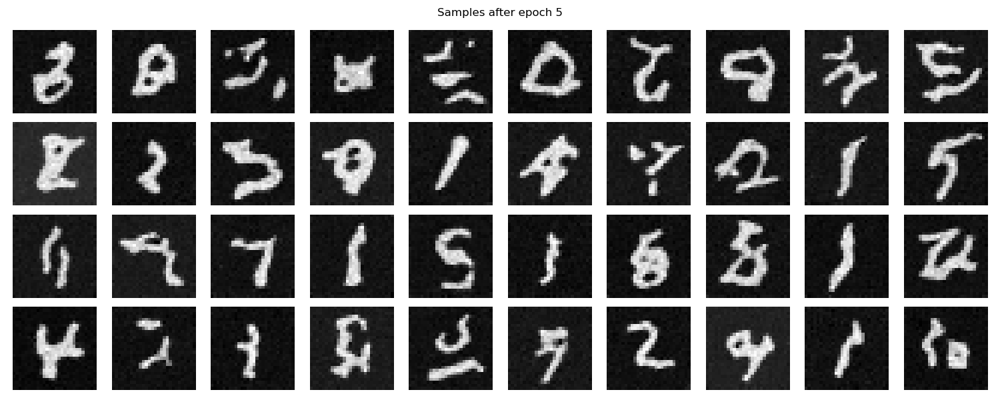

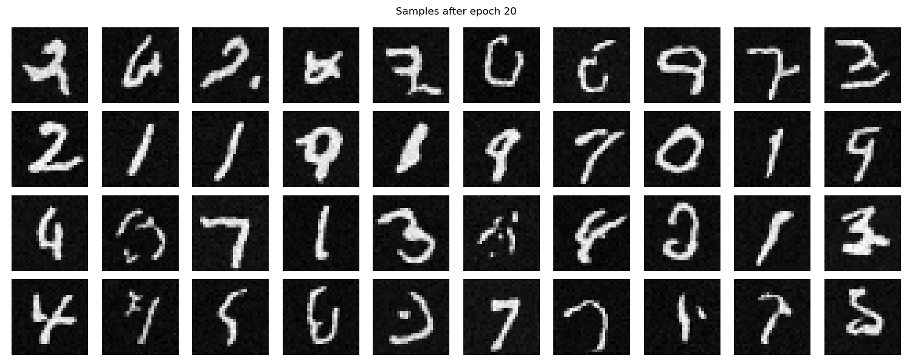

and the training curve for the time-conditioned DDPM is:

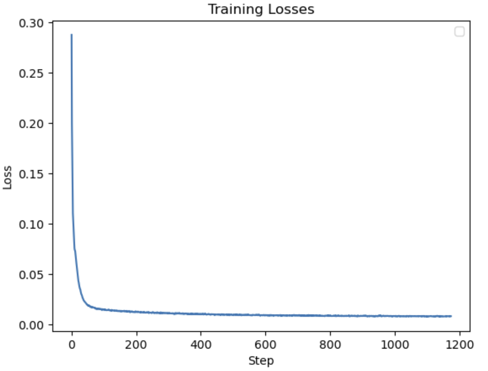

#### B2.2 Class-conditioned DDPM

The performance of solely time-conditioned sampling is not good, because the model doesn't know which digit it's supposed to proceed towards. Now, we add a class conditioned vector to the architecture by multipling certain layers with the embedding of class vectors. The pseudo code is

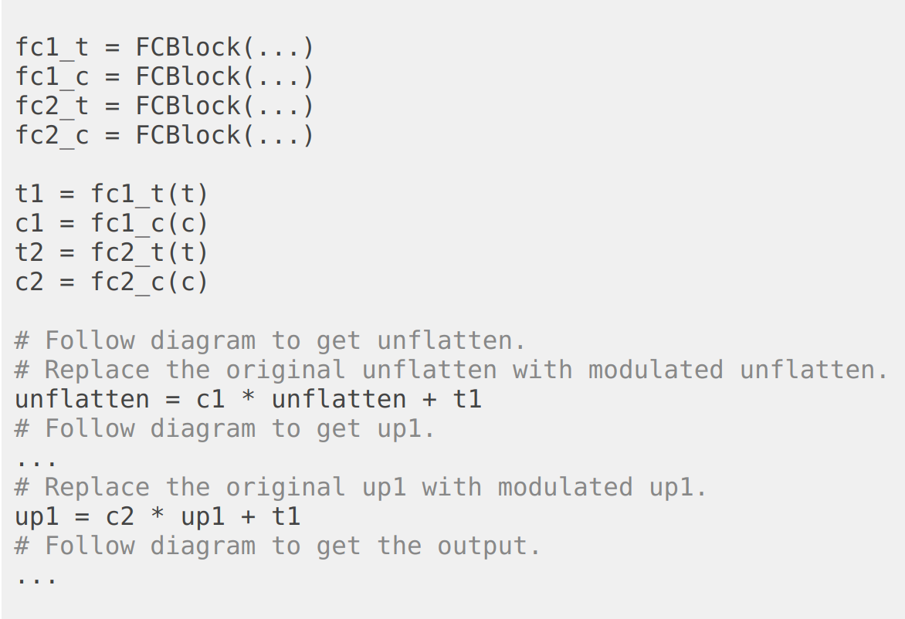

We follow this new algorithm to train the model

and follow this algorithm to sample

Here are some samples, with CFG $\gama=5$, after `epoch=5` and `epoch=20` respctively:

and the training curve for the time-conditioned DDPM is:

## Bells & Whistles, Part B

### Gifs for Time-conditioned and Class-conditioned DDPMs

I create some GIFs on the denosing process of `tc_ddpm` and `cc_ddpm` at different epoches. Here are the results:

**time conditioned DDPM after epoch 1, 10, and 20**

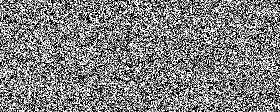

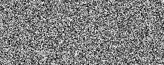

**class conditioned DDPM after epoch 1, 10, and 20**

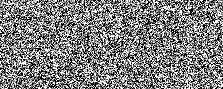

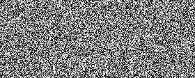

### Rectified Flow

The problem interested in the rectified flow is that, given two distributions $\pi_0, \pi_1$, we have two observations $X_0, X_1 \in \mathbb{R}^d$. We are interested in finding a transition map $T: \mathbb{R}^d \to \mathbb{R}^d$ such that $T(X_0) \sim \pi_1$ when $X_0\sim\pi_0$.

This problem can be reformulated into finding a drift force $v(X_t, t)$, such that

$$\frac{dX_t}{dt} = v(X_t, t)$$
for $t\in[0,1]$. This drift force can be thought as an instruction of movement at time $t$ for the given $X_t$ to move towards $X_1$. 

The rectified flow suggests that, the linear interpolation, $X_1 - X_0$, effectively translates $X_0$ towards $X_1$. However, it cannot be modeled by $v(X_t, t)$ because (1) it peaks at $X_1$, which should not be known at intermediate timesteps, and (2) it's not deterministic even though $X_t$ and $t$ are deterministic, meaning it's not fully dependent on $X_t$ and $t$. This [guide](https://www.cs.utexas.edu/~lqiang/rectflow/html/intro.html) provides a visual explanation about why.

Therefore, we cannot use the linear interpolation drift directly, but we can use a neural net that's fully dependent on $t$ and $X_t$ to approximate it, by minimizing

$$\min_\theta \int_0^1\mathbb{E}\left[(X_1 - X_0) - v_\theta(X_t,t)||^2\right]\;dt$$
 The author of rectified flow shows that this approximated trajectory is guaranteed to have the same marginal distribution on the two ends and also guaranteed to have a lower transition cost over any convex cost function. 

 I implemented the rectified flow following the code in [this repo](https://github.com/cloneofsimo/minRF/tree/main). Specifically, I used the same `Class-conditioned UNet` as in the DDPM above as the neural net to estimate the drifted force $v_\theta$. Then, let $X_0$ be the clean images and $X_1$ be the pure noise, we approximate the added noise $X_1-X_0$ using the neural net, conditioned on both time and class.  

 In inference time, I use a backward Euler method with total step `N = 300`. Specifically, we move from $t=1$ gradually to $t=0$ in 300 steps, so $\Delta t = \frac{1}{N}$. And at each $t$, we compute the new estimate $X_t = X_t - \Delta t \cdot \left(v_{c, t} + \gamma(v_{c, t} - v_{u, t})\right)$, where $v_{c,t} = \mathrm{UNet}(X_t, t, \text{cond})$, $v_{c,t} = \mathrm{UNet}(X_t, t, \text{null cond})$, and $\gamma$ is the CFG constant. 

Here are some results of rectified flow after respective 1 and 20 epoches:
**After 1 epoch** 

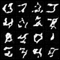

**After 20 epoches** 
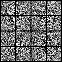

### Rectified Flow: Reflow

Another amazing property is that, as introduced above, the rectified flow guarantees a lower transition cost than before. Therefore, if we repeatedly apply the rectified flow, called `Recflow`, namely 
$$Z^{k+1} = \mathrm{Recflow}(Z_0^k, Z_1^k)$$
with $(Z_0^0, Z_1^0) = (X_0, X_1)$. Then the transition map will be straightened such that the flow looks like a straight line in its space. This property allows us to solve the Euler equation in one or very few step, namely
$$Z^k_t = Z^k_0 + t\cdot v^k(Z_0^k, t)$$ 
Here's also a picture from [this site](https://www.cs.utexas.edu/~lqiang/rectflow/html/intro.html) that helps explain this:

In this project, I attempted repeating Reflow for 3 times and sample using a small `N=3`, and here are the results:

**Recflow_1 with `N = 3`**
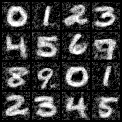
**Recflow_2 with `N = 3`**
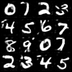
**Recflow_3 with `N = 3`**

