## Introduction

Ever wondered how we can turn regular photos into stunning 3D models? Enter NeRF - Neural Radiance Fields - a breakthrough technology that's transforming 3D content creation. At its heart, NeRF is an elegant fusion of deep learning and ray optics, representing 3D scenes not through traditional geometry, but through a neural network that maps 3D points and viewing angles to colors and densities.

## Part 1: Fit a Neural Field to a 2D Image

Before enterting the fascinating world of Nerf, let's work on its simplified version of reconstructing a fixed 2D image. In Nerf, we will use a neural network to fit a radiance field and render images from different camera center and viewing angle, while in the 2D case, there's no radiance or different viewing origins, so we are just predicting the RGB value of the training image given the position of the pixel, namely
$$
F: [0, W]\times [0, H] \ni[u,v]^T \to \mathrm{rgb}_{u,v} \in [0,1]^3
$$

### Implementation Details

The model architecture is implemented following

Before feeding the 2-$d$ positional vector into the network, it must go through a positional encoding. Unlike the positional encoding used in the transformer architecture intended to give an order of tokens, here, the PE is used to expand the input to higher frequencies so the details can be well distinguished. The formula for PE is

$$
\mathrm{PE}(x) = \left[x, \sin(2^0\pi x), \cos(2^0\pi x), \cdots, \sin(2^{L-1}\pi x), \cos(2^{L-1}\pi x)\right]
$$

I also implemented a data loader to speed up the training process, where I randomly pick $N$ pixels from the training image in every epoch, get the pixel positions of these pixels which are normalized into $[0,1]$ scale.

The model is trained with MSE loss between the predicted RGB value and the ground truth values. The final quality of reconstructed image is measured by the **Peak signal-to-noise ratio (PSNR)**, defined as
$$
PSNR = 10 \cdot \log_{10}\left(\frac{1}{MSE}\right)
$$

### Summary of Outcomes

I trained the model on two testing examples. 

#### The fox

I used the following hyper-parameters when training:

$$\mathrm{Adam \text{ }lr} = 10^{-2} \quad L = 10 \quad  \mathrm{Batch}=10000 $$

The training process versus PSNR is

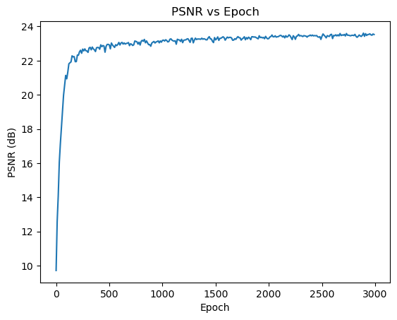

and the training loss against epoch

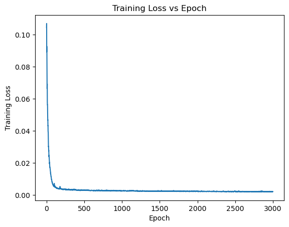

Acorss the iterations, the reconstructed images evolve like 

#### The Cherry Blossom

I used the following hyper-parameters when training:

$$\mathrm{Adam \text{ }lr} = 10^{-3} \quad L = 10 \quad  \mathrm{Batch}=10000 \quad \text{epoch} = 5000$$ 

and the training process versus PSNR is

and the training loss against epoch

Acorss the iterations, the reconstructed images evolve like 

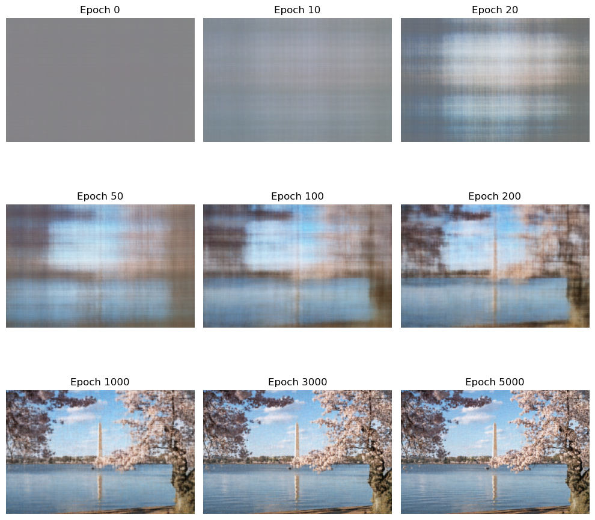

### Hyper Parameter Tuning

To explore the performance of the model under different values of embedding length $L$ and learning rates, I compare the results of different hyperparatemers and summarize them below

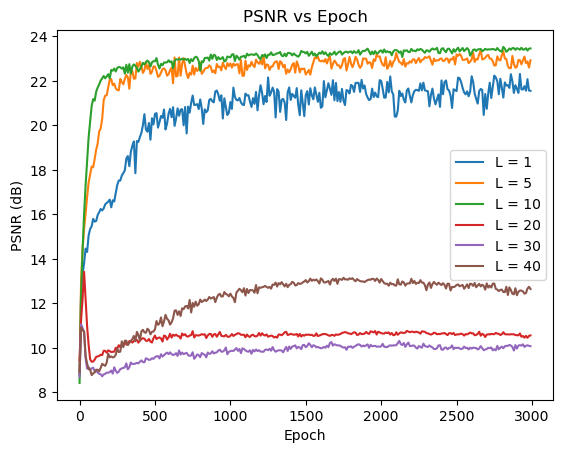

From the visualizations above, we see that $L=10$ achieves the best performance. Lower $L$ values fail to capture the high frequencies, while higher $L$ values are difficult to converge to a good result within 3000 epoches.

Fixing $L=10$, now we compare different learning rates:

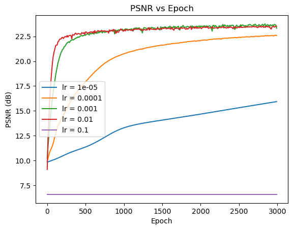

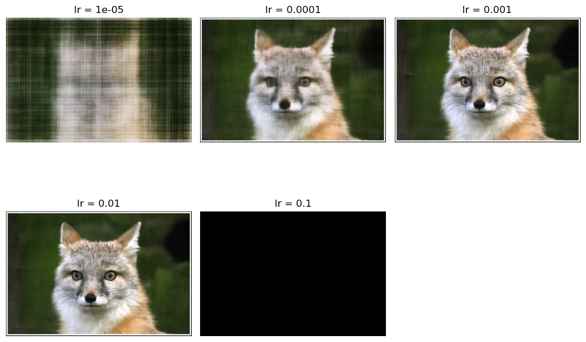

From the results above, we see that $lr=0.01$ and $lr=0.001$ have the best performance. 

## Part 2: Fit a Neural Radiance Field from Multi-view Images

Now, we are ready to train the 3D case of Neural Radiance Field. Generally, given random images, we need to run structure from motion (SfM) to recover the camera positons (camera-to-world matrices). 

For simplicity, we will use the lego dataset of the original paper, which already has all the camera positions known. Some example images are

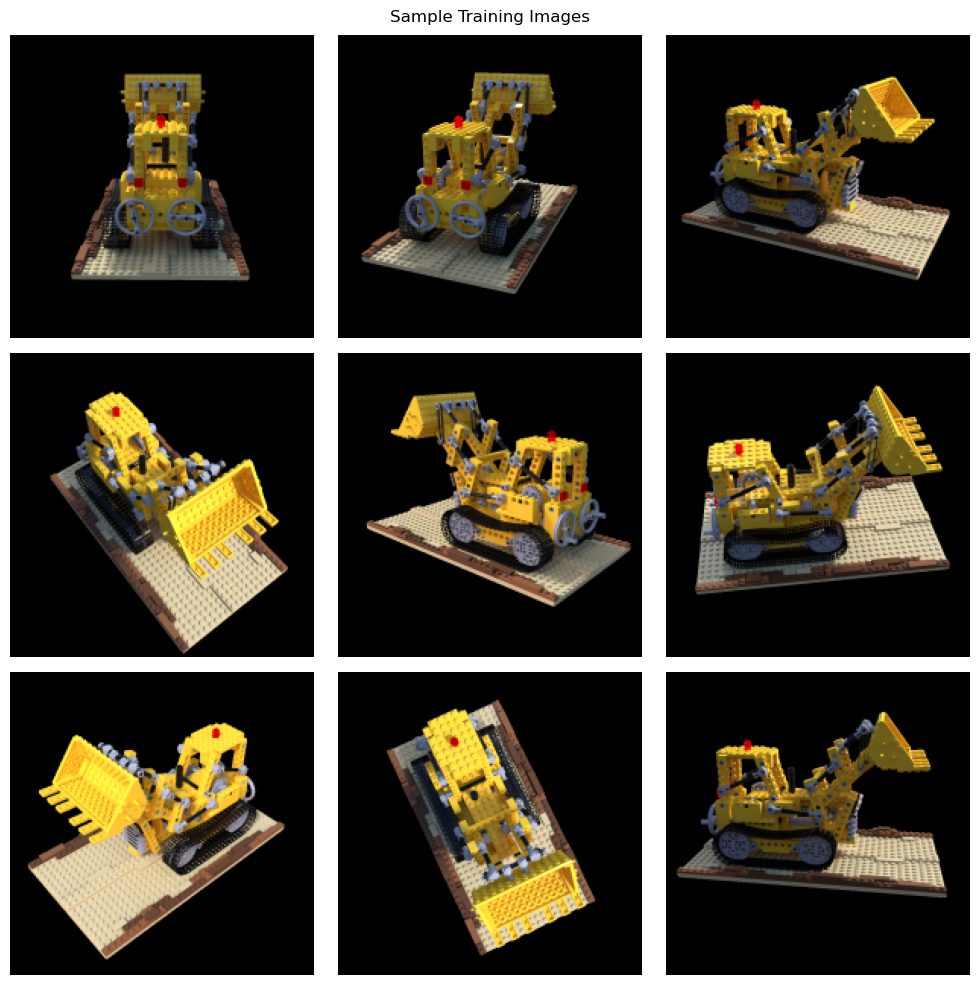

### Process of Sampling Rays

To train the model, we need to sample rays from the images. By rays we mean a directed 3D line emitted from the camera center and passing through a pixel of the camera plane. 

Fix a camera, we have known intrinsic $K$, then for a batched pixel coordinates, $\{(u^{(p)}_i, v^{(p)}_i)\}_{i=1}^n$, the following equation is satisfied:
$$
s_i\begin{bmatrix}u^{(p)}_i\\ v^{(p)}_i\\ 1\end{bmatrix} = K\begin{bmatrix}x^{(c)}_i\\ y^{(c)}_i\\ z^{(c)}_i\end{bmatrix}
$$
that is, given depth $s$, we can obtain the corresponding point in camera coordinate using
$$
\begin{bmatrix}x^{(c)}_i\\ y^{(c)}_i\\ z^{(c)}_i\end{bmatrix} = sK^{-1}\begin{bmatrix}u^{(p)}_i\\ v^{(p)}_i\\ 1\end{bmatrix}
$$

(Considering the ray emitting from the camera center and passing through the pixel at the image plane, then specifying the depth $s$ can be seen as choosing the point along this ray with the corresponding depth in camera coordinate system)

Then, given the camera-to-world matrix 
$$
\mathcal{M}_{c2w} = \begin{bmatrix}
R_{3\times 3}&t_{3\times 1}\\0_{1\times 3}&1
\end{bmatrix}^{-1} = \begin{bmatrix}
R^{-1}&-R^{-1}t\\0&1
\end{bmatrix}
$$
we can convert the 3-$d$ points in camera coordinates $\{(x^{(c)}_i,  y^{(c)}_i,  z^{(c)}_i)\}_{i=1}^n$ back to the points in real-world coordinates $\{(x^{(w)}_i,  y^{(w)}_i,  z^{(w)}_i)\}_{i=1}^n$ using the formula
$$
\begin{bmatrix}x^{(w)}_i\\ y^{(w)}_i\\ z^{(w)}_i\end{bmatrix} = \mathcal{M}_{c2w}\begin{bmatrix}x^{(c)}_i\\ y^{(c)}_i\\ z^{(c)}_i\end{bmatrix}
$$
the camera center is calculated from $M_{c2w}$ by
$$r_o = -R^{-1}t$$
and we can get the direction $r_d$ by 
$$
r_d = \frac{x_w - r_o}{||x_w - r_o||_2}
$$
Then, the pair $(r_o, r_d)$ represents the ray
$$r = r_o + tr_d$$

With these relations, I implemented the dataset which randomly samples `n_sample` rays at each iteration.

In detail, I merged all training images to have `H*W*n_training` elements and each element representing a ray emitted from some training camera position. We can extract the correct ray by first finding the correct image using `idx // (H*W)`, then find the ray's id within that image using `idx % (H*W)`, finally, we find the correct pixel `(id_in_img % W, id_in_img // W)`. Then, we are allowed to sample `n_sample` rays at each iteration. 

### Sampling Points Along the Rays

After getting the rays, we need to sample $N_c$ points along the ray to get the RGB values at these points. For simplicity, we sample these points ($t$ values) by uniformly choose points from $t \in [near, far]$  and add a small noise to it. In this project, I used $N_c = 64$, and here are some results of sampling rays and points:

and the result of sampling all on one camera:

According to the original paper, we can use a more clever way of sampling by sampling from the CDF of uniform sampling to sample more points with higher density.

### Model Architecture

Similar to Part 1, we use a MLP to fit the function

$$
F: \{(x, y, z), r_d\} \to \{(r,g,b), \sigma\}
$$

That is, given the position of a partical and its viewing angle, the model predicts the RGB value and density (visibility) of that point from the specified angle (when angle changes, the point also looks different).

The model is implemented according to

### Volumn Rendering

When doing reconstruction, given the position of a camera (`c2w` mtrix) and its resolution, we use the dataloader to create query points along each ray in the image, and then use the model to predict the RGB values of points along each ray. Then, we need to integrate the color values with the density to get the RGB value from desired view point. The integration is given by

$$
\hat{C}(r) = \sum_{i=1}^{N_c} T_i \left(1 - \exp\left(-\sigma_i\delta_i\right)\right)c_i \quad \text{where } T_i = \exp\left(-\sum_{j=1}^{i-1}\sigma_j\delta_j\right)
$$

In our naive implementation, $\delta$ is always a fixed value, representing discrete $\Delta t$. Using this method, we can construct the image from any given camera position.

### Summary of Outcomes

I used the following settings during training:

$$
\mathrm{batch\text{ }size}: 3000 \quad \text{lr}: 5\cdot 10^{-5} \quad N_c: 64 \quad \text{n\_iteration}: 9000
$$

Optimizer settings:

$$
\text{AdamW with } \gamma = 0.95 \quad \text{and CosineAnnealingLR Scheduler}
$$

The training loss against the training process:

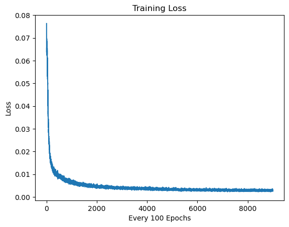

(Please ignore the "every 100 epochs" title, that's a plot mistake)

The PNSR improvement against the training process:

From the plot, we see that the final average PSNR across the 10 validation images is 25.79. 

Some images showing the evolution of reconstruction:

The spherical rendering of lego video:

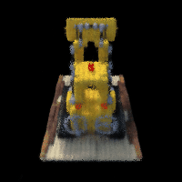

## Bells & Whistles

### Change Background Color

Currently, the background of all viewing angles is rendered as black. Let's recall the volumn rendering formula

$$
\hat{C}(r) = \sum_{i=1}^{N_c} T_i \left(1 - \exp\left(-\sigma_i\delta_i\right)\right)c_i \quad \text{where } T_i = \exp\left(-\sum_{j=1}^{i-1}\sigma_j\delta_j\right)
$$
In this expression, $T_i = \exp\left(-\sum_{j=1}^{i-1}\sigma_j\delta_j\right)$ represents the probability that the light didn't terminate at the previous $i-1$ particles, while $1 - \exp\left(-\sigma_i\delta_i\right)$ is the probability that the light terminates at the curretn particle. Therefore, to use a different background color other than black, consider the case that the light passes through all sampled points and goes to infinity (the background). The probability that this happens is
$$
T_{N_c+1} = \exp\left(-\sum_{j=1}^{N_c}\sigma_j\delta_j\right)
$$
and if this happens, we will see the background color **b**. Therefore, the new rendering method is given by

$$
\hat{C}(r) = \sum_{i=1}^{N_c} T_i \left(1 - \exp\left(-\sigma_i\delta_i\right)\right)\textbf{c}_i+ T_{N_c+1}\textbf{b}
$$

Result if changing background color to light blue:

and pure white:

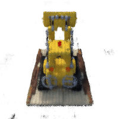

Notice that there are some black dots in the background, I think that's because the model doesn't predict well at those positions. 

### Rendering the Depth Map

If we know the point is given by $p = r_o + tr_d$, we can compute its depth using
$$
z = ||p - r_o|| = t||r_d|| = t
$$
which allows us to redner the depth map from any given angle. 

Here is an example result of doing so

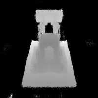

